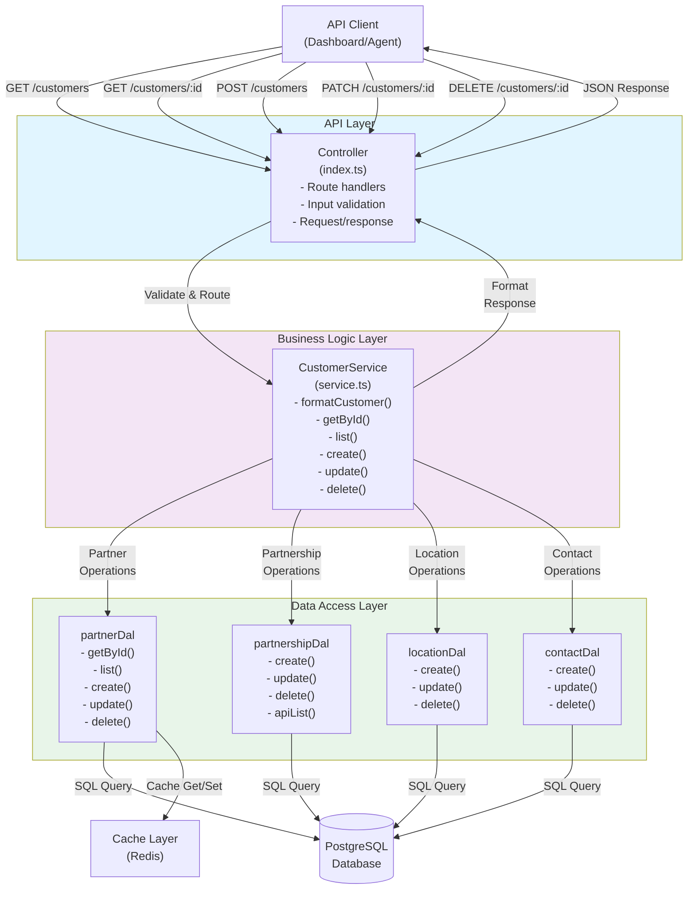
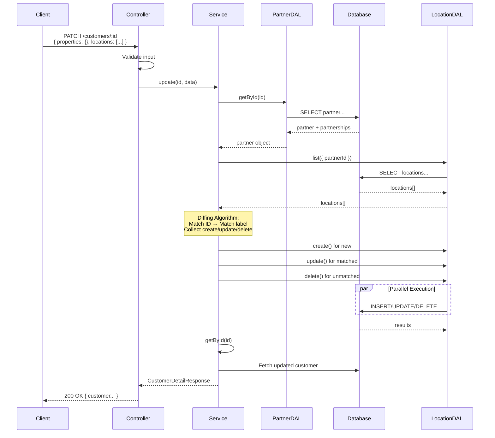

# Customer API Reference

## Overview

The Customers API module is a simplified REST interface built on top of the underlying Partners and Partnerships data model. It automatically manages the `partnershipType = "customer"` classification and abstracts away partnership complexity to provide a clean, intuitive API for managing customer relationships.

**Module Location**: `apps/external-api/src/modules/customer/`

**Key Files**:
- `index.ts` - Controller and route handlers
- `service.ts` - Business logic layer
- `../../schemas/customer.ts` - TypeScript schemas and validation
- `../../packages/dal/src/partners.ts` - Data access layer

**Architecture Pattern**: Controller → Service → DAL

The module uses a sophisticated diffing algorithm to intelligently manage nested resources (locations and contacts) during updates, making it easy for clients to maintain related data without worrying about create/update/delete logic.

---

## 1. Data Model & Schema Mapping

### Underlying Architecture

The Customers API exposes a flattened view of three database entities:

```
Partner (base entity)
├── Basic fields
│   ├── id (string)
│   ├── organizationId (string)
│   ├── name (string, required)
│   ├── legalName (string | null)
│   ├── code (string | null)
│   ├── notes (string | null)
│   ├── email (string | null)
│   ├── phone (string | null)
│   └── website (string | null)
│
├── Partnership (type = "customer")
│   ├── id (string)
│   ├── status: active | inactive | pending | on_hold | suspended | terminated
│   ├── properties (object)
│   ├── defaultCurrency (string, default: "USD")
│   ├── paymentTermsDays (number | null)
│   ├── creditLimit (number | null)
│   ├── leadTimeDays (number | null)
│   └── minimumOrderValue (number | null)
│
├── Locations[] (nested, partner-owned)
│   ├── id (string)
│   ├── type: "billing" | "shipping" | "remittance"
│   ├── label (string | null)
│   ├── addressLine1, addressLine2 (strings)
│   ├── city, state, postalCode, country (strings)
│   ├── isDefault (boolean)
│   ├── contactName, contactPhone (strings | null)
│   ├── deliveryInstructions (string | null)
│   ├── longitude, latitude (number | null)
│   ├── formattedAddress (string | null)
│   ├── properties (object)
│   └── createdAt, updatedAt, deletedAt (ISO 8601 timestamps)
│
└── Contacts[] (nested, partner-owned)
    ├── id (string)
    ├── name (string, required)
    ├── title (string | null)
    ├── role: "primary" | "sales" | "accounting" | "logistics" | "executive" | null
    ├── isPrimary (boolean)
    ├── notes (string | null)
    ├── email (string | null)
    ├── phone (string | null)
    ├── mobile (string | null)
    ├── properties (object)
    └── createdAt, updatedAt, deletedAt (ISO 8601 timestamps)
```

### API Response Format

The API returns a flattened customer object that merges partner and partnership data:

```typescript
{
  // Partner fields (flattened to top level)
  id: string
  organizationId: string
  partnershipId: string
  name: string
  legalName: string | null
  code: string | null
  notes: string | null
  email: string | null
  phone: string | null
  website: string | null

  // Partnership fields (flattened to top level)
  status: "active" | "inactive" | "pending" | "on_hold" | "suspended" | "terminated"
  paymentTermsDays: number | null
  creditLimit: number | null
  defaultCurrency: string
  leadTimeDays: number | null
  minimumOrderValue: number | null
  properties: Record<string, any>

  // Timestamps
  createdAt: ISO 8601 string
  updatedAt: ISO 8601 string
  deletedAt: ISO 8601 string | null

  // Nested relations
  locations?: Location[]
  contacts?: Contact[]
}
```

### Status Values

The `status` field comes from the partnership record and indicates the customer relationship status:

- **active**: Customer is actively trading
- **inactive**: Customer is not currently active
- **pending**: New customer, relationship not yet confirmed
- **on_hold**: Customer account is temporarily suspended
- **suspended**: Customer account is formally suspended
- **terminated**: Customer relationship has ended

---

## 2. API Endpoints

### GET /customers

**List customers with filtering, pagination, and sorting**

#### Request

```
GET /customers?status=active&limit=50&offset=0&sort=name&direction=asc
```

#### Query Parameters

| Parameter | Type | Default | Max | Description |
|-----------|------|---------|-----|-------------|
| `status` | string | - | - | Filter by partnership status. Valid values: `active`, `inactive`, `pending`, `on_hold`, `suspended`, `terminated` |
| `limit` | number | 100 | 1000 | Number of results per page |
| `offset` | number | 0 | - | Pagination offset (zero-based) |
| `sort` | string | - | - | Sort column: `createdAt`, `updatedAt`, or `name` |
| `direction` | string | desc | - | Sort direction: `asc` or `desc` |

#### Response

```json
{
  "count": 42,
  "data": [
    {
      "id": "par_xyz123",
      "organizationId": "org_123",
      "partnershipId": "pship_abc456",
      "name": "Acme Corp",
      "status": "active",
      "defaultCurrency": "USD",
      "paymentTermsDays": 30,
      "creditLimit": 100000,
      "createdAt": "2024-01-15T10:30:00Z",
      "updatedAt": "2024-01-15T10:30:00Z",
      "deletedAt": null,
      "properties": {}
    }
  ]
}
```

#### Implementation Details

- Uses `CustomerService.list()` which calls `partnershipDal.apiList()`
- SQL-level pagination ensures efficient handling of large datasets
- Results sorted by specified column (or createdAt desc by default) with stable secondary sort by ID
- Only returns non-deleted records

#### Error Cases

| Status | Condition |
|--------|-----------|
| 400 | Invalid status, limit, offset, sort, or direction values |
| 401 | Missing organization context in request |

---

### GET /customers/:id

**Retrieve a single customer by ID**

#### Request

```
GET /customers/par_xyz123
```

#### Path Parameters

| Parameter | Type | Description |
|-----------|------|-------------|
| `id` | string | Customer/Partner ID |

#### Response

```json
{
  "id": "par_xyz123",
  "organizationId": "org_123",
  "partnershipId": "pship_abc456",
  "name": "Acme Corp",
  "legalName": "Acme Corporation Inc.",
  "code": "ACME-001",
  "notes": "Important strategic partner",
  "email": "contact@acme.com",
  "phone": "+1-555-0100",
  "website": "https://acme.com",
  "status": "active",
  "paymentTermsDays": 30,
  "creditLimit": 100000,
  "defaultCurrency": "USD",
  "leadTimeDays": 7,
  "minimumOrderValue": 500,
  "properties": {
    "industry": "Manufacturing",
    "account_tier": "premium"
  },
  "createdAt": "2024-01-15T10:30:00Z",
  "updatedAt": "2024-02-20T14:45:00Z",
  "deletedAt": null,
  "locations": [
    {
      "id": "loc_456",
      "type": "billing",
      "label": "Headquarters",
      "addressLine1": "123 Main Street",
      "city": "New York",
      "state": "NY",
      "country": "USA",
      "isDefault": true,
      "properties": {}
    }
  ],
  "contacts": [
    {
      "id": "con_789",
      "name": "John Doe",
      "title": "Procurement Manager",
      "role": "primary",
      "isPrimary": true,
      "email": "john@acme.com",
      "phone": "+1-555-0101",
      "properties": {}
    }
  ]
}
```

#### Error Cases

| Status | Condition |
|--------|-----------|
| 401 | Missing organization context |
| 404 | Customer not found or customer has no customer partnership |

---

### POST /customers

**Create a new customer with optional nested locations and contacts**

#### Request

```
POST /customers
Content-Type: application/json
```

#### Request Body (Minimal)

```json
{
  "name": "New Customer LLC"
}
```

#### Request Body (Full Example)

```json
{
  "name": "Acme Manufacturing Corp",
  "legalName": "Acme Manufacturing Corporation Inc.",
  "code": "ACME-2024",
  "notes": "Strategic partnership for Q2 2024",
  "email": "orders@acme.com",
  "phone": "+1-555-0100",
  "website": "https://acme.com",
  "status": "active",
  "paymentTermsDays": 30,
  "creditLimit": 250000,
  "defaultCurrency": "USD",
  "leadTimeDays": 7,
  "minimumOrderValue": 1000,
  "properties": {
    "industry": "Manufacturing",
    "account_tier": "premium",
    "region": "North America"
  },
  "locations": [
    {
      "type": "billing",
      "isDefault": true,
      "label": "Headquarters",
      "addressLine1": "123 Industrial Blvd",
      "addressLine2": "Suite 200",
      "city": "Chicago",
      "state": "IL",
      "postalCode": "60601",
      "country": "USA",
      "contactName": "John Smith",
      "contactPhone": "+1-555-0101",
      "properties": {
        "building_code": "HQ-001"
      }
    },
    {
      "type": "shipping",
      "isDefault": false,
      "label": "Warehouse",
      "addressLine1": "456 Logistics Way",
      "city": "Indianapolis",
      "state": "IN",
      "country": "USA",
      "properties": {}
    }
  ],
  "contacts": [
    {
      "name": "John Doe",
      "title": "Procurement Director",
      "role": "primary",
      "isPrimary": true,
      "email": "john@acme.com",
      "phone": "+1-555-0101",
      "properties": {
        "preferred_contact_method": "email"
      }
    },
    {
      "name": "Jane Smith",
      "title": "Accounts Manager",
      "role": "accounting",
      "isPrimary": false,
      "email": "jane@acme.com",
      "properties": {}
    }
  ]
}
```

#### Request Schema

| Field | Type | Required | Notes |
|-------|------|----------|-------|
| `name` | string | Yes | Non-empty, cannot be whitespace-only |
| `legalName` | string | No | Full legal entity name |
| `code` | string | No | Unique customer code |
| `notes` | string | No | Internal notes |
| `email` | string | No | Contact email |
| `phone` | string | No | Contact phone |
| `website` | string | No | Website URL |
| `status` | string | No | Default: "active" |
| `paymentTermsDays` | number | No | Payment terms in days |
| `creditLimit` | number | No | Credit limit in base currency |
| `defaultCurrency` | string | No | Default: "USD" |
| `leadTimeDays` | number | No | Lead time in days |
| `minimumOrderValue` | number | No | Minimum order value |
| `properties` | object | No | Custom metadata (must be object, not array) |
| `locations` | array | No | Array of location objects |
| `contacts` | array | No | Array of contact objects |

#### Response

```json
{
  "id": "par_newcust123",
  "organizationId": "org_123",
  "partnershipId": "pship_newcust456",
  "name": "Acme Manufacturing Corp",
  "status": "active",
  "defaultCurrency": "USD",
  "createdAt": "2024-03-01T09:00:00Z",
  "updatedAt": "2024-03-01T09:00:00Z",
  "deletedAt": null,
  "locations": [...],
  "contacts": [...]
}
```

#### Business Logic Flow

1. **Create Partner**: Inserts partner record with provided basic fields
2. **Create Partnership**: Creates customer partnership (type="customer") with financial fields and properties
3. **Create Relations**: In parallel, creates all locations and contacts associated with the partner
4. **Return**: Fetches complete customer object with all nested relations

#### Validation

- `name`: Required, cannot be empty or contain only whitespace
- `properties`: If provided, must be an object (not array or null)
- `locations[].addressLine1`, `locations[].city`, `locations[].country`: Cannot be empty/whitespace
- `contacts[].name`: Cannot be empty/whitespace
- Custom IDs are rejected (IDs auto-generated by system)

#### Error Cases

| Status | Condition |
|--------|-----------|
| 400 | Validation failed (name empty, properties not object, whitespace-only strings, custom ID provided) |
| 401 | Missing organization context |

---

### PATCH /customers/:id

**Update an existing customer with intelligent nested resource diffing**

#### Request

```
PATCH /customers/par_xyz123
Content-Type: application/json
```

#### Request Body (Partial Update)

```json
{
  "email": "newemail@acme.com",
  "properties": {
    "account_tier": "enterprise"
  }
}
```

#### Request Body (Complex Update with Nested Resources)

```json
{
  "paymentTermsDays": 45,
  "creditLimit": 500000,
  "properties": {
    "new_field": "new_value",
    "old_field": null
  },
  "locations": [
    {
      "id": "loc_existing_123",
      "addressLine1": "123 Main Street - Updated"
    },
    {
      "label": "hq",
      "addressLine1": "999 Executive Plaza",
      "city": "Miami",
      "country": "USA"
    },
    {
      "type": "shipping",
      "label": "New Warehouse",
      "addressLine1": "777 Logistics Ln",
      "city": "Dallas",
      "country": "USA"
    }
  ],
  "contacts": [
    {
      "id": "con_existing_456",
      "name": "John Doe",
      "phone": "+1-555-0199"
    },
    {
      "name": "jane smith",
      "role": "sales"
    }
  ]
}
```

#### Response

Returns the complete updated customer object with all nested relations.

#### Advanced Features

**1. Properties Merge**

Properties support a three-operation merge system:

- **Add**: New keys in incoming properties are added
- **Update**: Existing keys are updated to new values
- **Delete**: Set a key to `null` to delete it

Example:
```json
// Original properties
{ "tier": "gold", "region": "west", "discount": 10 }

// PATCH request
{ "properties": { "tier": "platinum", "discount": null, "verified": true } }

// Result
{ "tier": "platinum", "region": "west", "verified": true }
```

**2. Location Diffing**

The system intelligently matches incoming locations to existing ones using a two-tier matching strategy:

**Priority 1: Match by ID** (if `id` field provided)
- If ID exists in database, location is updated
- Incoming ID: `{ "id": "loc_123", "city": "Boston" }` → UPDATE

**Priority 2: Match by Label** (case-insensitive, if no ID match)
- Matches on label field case-insensitively (null-safe)
- Incoming label: `{ "label": "hq", ... }` matches existing `{ "label": "HQ", ... }`
- This allows client-side code to identify locations by user-friendly label

**Operations**:
- **Update**: Location matched by ID or label → merged with property merge
- **Create**: Location with no ID and no matching label → created
- **Delete**: Existing location unmatched by any incoming location → soft-deleted

Example Flow:
```json
// Existing locations
[
  { "id": "loc_1", "label": "HQ", "city": "NYC" },
  { "id": "loc_2", "label": "Warehouse", "city": "NJ" }
]

// PATCH request
{
  "locations": [
    { "id": "loc_1", "city": "Boston" },
    { "label": "warehouse", "city": "Princeton" },
    { "type": "shipping", "label": "New DC", "city": "PA" }
  ]
}

// Results
- loc_1: Updated (city NYC → Boston)
- loc_2: Updated (matched by "warehouse" = "Warehouse" case-insensitive, city NJ → Princeton)
- New location created: "New DC" in Pennsylvania
- No deletions (all existing were matched)
```

**3. Contact Diffing**

Similar to locations but matches on contact name instead of label:

**Priority 1: Match by ID** (if `id` field provided)
**Priority 2: Match by Name** (case-insensitive, if no ID match)

Contact name is required (`name` field must not be empty).

Example:
```json
// Existing contacts
[
  { "id": "con_1", "name": "John Doe", "role": "primary" },
  { "id": "con_2", "name": "Jane Smith", "role": "accounting" }
]

// PATCH request
{
  "contacts": [
    { "id": "con_1", "phone": "+1-555-9999" },
    { "name": "jane smith", "phone": "+1-555-8888" },
    { "name": "Bob Wilson", "role": "sales" }
  ]
}

// Results
- con_1: Updated (phone added)
- con_2: Updated (matched by "jane smith" = "Jane Smith" case-insensitive, phone updated)
- New contact created: Bob Wilson
- No deletions
```

**4. Parallel Execution**

All location and contact operations (creates, updates, deletes) are executed in parallel for performance.

#### Validation

Same as POST request for provided fields.

#### Error Cases

| Status | Condition |
|--------|-----------|
| 400 | Validation failed (whitespace-only strings, properties not object, contact without name) |
| 401 | Missing organization context |
| 404 | Customer not found or no customer partnership |

---

### DELETE /customers/:id

**Soft delete a customer**

#### Request

```
DELETE /customers/par_xyz123
```

#### Response

```json
{
  "message": "success"
}
```

#### Behavior

- Performs soft delete on the customer's partner record
- Automatically cascades to soft-delete all:
  - Customer partnerships
  - Associated locations
  - Associated contacts
- Soft-deleted records are excluded from future queries (`deletedAt` is set but record not removed)

#### Error Cases

| Status | Condition |
|--------|-----------|
| 401 | Missing organization context |
| 404 | Customer not found |

---

## 3. Nested Resource Diffing Algorithm

### Overview

The update operation uses a sophisticated diffing algorithm to intelligently manage nested resources. This allows clients to:
- Reference existing resources by ID or user-friendly identifier (label/name)
- Specify only the resources they want (not the complete list)
- Have the system figure out what needs to be created, updated, or deleted

### Location Diffing Algorithm

**Source**: `service.ts` lines 434-589

```
Input: incoming locations array from PATCH request
Step 1: Build lookup maps
  - existingById: Map<locationId, location>
  - existingByLabel: Map<label.toLowerCase(), location>
  - matchedExistingIds: Set (track which existing were matched)
  - matchedExistingLabels: Set (track which labels were matched)

Step 2: For each incoming location:
  if location.id provided:
    match = existingById.get(location.id)
    if match:
      action = UPDATE
      mark match.id as matched
      mark match.label as matched
  
  if no match and location.label provided:
    match = existingByLabel.get(location.label.toLowerCase())
    if match:
      action = UPDATE
      mark match.id as matched
      mark match.label as matched
  
  if no match:
    action = CREATE

Step 3: Determine deletions
  toDelete = existing locations not in matchedExistingIds
           AND (no label OR label not in matchedExistingLabels)

Step 4: Execute all operations in parallel
  - All creates
  - All updates (with property merge)
  - All deletes
```

### Contact Diffing Algorithm

**Source**: `service.ts` lines 592-741

Identical to location diffing except:
- Matches on `name` field instead of `label`
- Contact `name` is required (non-empty)
- Contacts without a name are skipped with warning log

### Property Merge Implementation

**Source**: `../../utils/properties.ts`

```typescript
function mergeProperties(
  existing: Record<string, any> | undefined,
  incoming: Record<string, any> | undefined
): Record<string, any> {
  const result = { ...existing };
  
  for (const [key, value] of Object.entries(incoming ?? {})) {
    if (value === null) {
      delete result[key];  // Delete if set to null
    } else {
      result[key] = value;  // Add or update
    }
  }
  
  return result;
}
```

---

## 4. Properties Management

### Overview

Properties is a flexible JSON object (`Record<string, any>`) that exists at three levels:
- **Customer Level**: On the partnership record
- **Location Level**: On each location
- **Contact Level**: On each contact

### Type Validation

Properties must be a plain object:
- ✓ Valid: `{}`
- ✓ Valid: `{ "key": "value", "nested": { "data": 123 } }`
- ✗ Invalid: `[]` (array)
- ✗ Invalid: `null`
- ✗ Invalid: `"string"`
- ✗ Invalid: `123`

If invalid, returns `400 Bad Request: "Properties must be an object"`

### Merge Behavior

When PATCH request includes properties, the system performs a smart merge:

```typescript
// Existing: { a: 1, b: 2, c: 3 }
// Incoming: { b: 999, c: null, d: 4 }
// Result:   { a: 1, b: 999, d: 4 }
```

Operations:
- **Add**: `{ d: 4 }` → Key added if not present
- **Update**: `{ b: 999 }` → Existing key updated to new value
- **Delete**: `{ c: null }` → Key set to null is completely removed from object

### Common Use Cases

**Custom Metadata**:
```json
{
  "properties": {
    "industry": "Manufacturing",
    "employee_count": 500,
    "founded_year": 1985
  }
}
```

**Integration Data**:
```json
{
  "properties": {
    "salesforce_id": "0015f00000IGY5QAAW",
    "crm_sync_date": "2024-03-01T09:00:00Z",
    "legacy_system_id": "CUST-12345"
  }
}
```

**Location-Specific Metadata**:
```json
{
  "locations": [
    {
      "label": "Warehouse",
      "properties": {
        "climate_controlled": true,
        "max_capacity_tons": 1000,
        "forklift_access": true
      }
    }
  ]
}
```

**Contact Preferences**:
```json
{
  "contacts": [
    {
      "name": "John Doe",
      "properties": {
        "preferred_contact_method": "email",
        "timezone": "America/New_York",
        "language": "en"
      }
    }
  ]
}
```

---

## 5. Validation Rules

### Customer/Partner Fields

| Field | Rules |
|-------|-------|
| `name` | Required on create; cannot be empty or whitespace-only |
| `legalName` | Optional; must be non-empty if provided |
| `code` | Optional; must be non-empty if provided |
| `notes` | Optional; must be non-empty if provided |
| `email` | Optional; must be valid email format if provided |
| `phone` | Optional; must be non-empty if provided |
| `website` | Optional; must be non-empty if provided |
| `properties` | Optional; must be object type if provided (not array, null, etc.) |

### Partnership Fields

| Field | Rules |
|-------|-------|
| `status` | Optional on create; must be one of: `active`, `inactive`, `pending`, `on_hold`, `suspended`, `terminated` |
| `paymentTermsDays` | Optional; must be number if provided |
| `creditLimit` | Optional; must be number if provided |
| `defaultCurrency` | Optional; default: "USD" |
| `leadTimeDays` | Optional; must be number if provided |
| `minimumOrderValue` | Optional; must be number if provided |

### Location Fields

| Field | Rules |
|-------|-------|
| `type` | Required; must be one of: `"billing"`, `"shipping"`, `"remittance"` |
| `label` | Optional; cannot be empty/whitespace if provided |
| `addressLine1` | Required on create; cannot be empty/whitespace; optional on update |
| `addressLine2` | Optional; cannot be empty/whitespace if provided |
| `city` | Required on create; cannot be empty/whitespace; optional on update |
| `state` | Optional; cannot be empty/whitespace if provided |
| `postalCode` | Optional; cannot be empty/whitespace if provided |
| `country` | Required on create; cannot be empty/whitespace; optional on update |
| `isDefault` | Optional; must be boolean if provided |
| `contactName` | Optional; cannot be empty/whitespace if provided |
| `contactPhone` | Optional; cannot be empty/whitespace if provided |
| `deliveryInstructions` | Optional; cannot be empty/whitespace if provided |
| `longitude`, `latitude` | Optional; must be numbers if provided |
| `formattedAddress` | Optional; cannot be empty/whitespace if provided |
| `properties` | Optional; must be object type if provided |
| `id` | Optional on update; specifies which location to update |

### Contact Fields

| Field | Rules |
|-------|-------|
| `name` | Required; cannot be empty or whitespace-only |
| `title` | Optional; cannot be empty/whitespace if provided |
| `role` | Optional; must be one of: `"primary"`, `"sales"`, `"accounting"`, `"logistics"`, `"executive"` |
| `isPrimary` | Optional; must be boolean if provided |
| `notes` | Optional; cannot be empty/whitespace if provided |
| `email` | Optional; cannot be empty/whitespace if provided |
| `phone` | Optional; cannot be empty/whitespace if provided |
| `mobile` | Optional; cannot be empty/whitespace if provided |
| `properties` | Optional; must be object type if provided |
| `id` | Optional on update; specifies which contact to update |

### Query Parameters (GET /customers)

| Parameter | Rules |
|-----------|-------|
| `status` | Optional; must be valid partnership status if provided |
| `limit` | Optional; must be integer 1-1000 |
| `offset` | Optional; must be integer >= 0 |
| `sort` | Optional; must be one of: `"createdAt"`, `"updatedAt"`, `"name"` |
| `direction` | Optional; must be one of: `"asc"`, `"desc"` |

### General Rules

- **No Custom IDs**: POST requests with `id` field are rejected with 400 error
- **Whitespace-Only Strings**: Any string field that should be non-empty cannot be whitespace-only
- **Objects Only**: Properties fields must be plain objects, not arrays or primitives
- **Name Required for Contacts**: Contacts without a name are skipped during PATCH with warning

---

## 6. Test Coverage Summary

### Test Suite Overview

**Location**: `apps/external-api/tests/customers/customers.test.ts`

**Type**: Stacking integration tests (each test builds on previous state)

**Total Tests**: 28 comprehensive tests across 7 phases

**Execution**: `bun run tests/customers/customers.test.ts`

### Test Phases

#### Phase 1: Foundation (Tests 1-5) - Customer Creation

1. **Minimal Customer**: Create with only required `name` field
2. **All Partner Fields**: Create with email, phone, website, notes, legal name, code
3. **Partnership Fields**: Create with payment terms, credit limit, currency, lead time, minimum order value
4. **Properties**: Create with custom metadata
5. **Full Creation**: Create with all fields plus 2 locations and 2 contacts

**Validates**: Basic CRUD operations, default values, field mapping

#### Phase 2: Basic Updates (Tests 6-9) - Simple Updates

6. **Single Field Update**: Update customer name
7. **Multiple Field Update**: Update email, phone, notes together
8. **Partnership Fields**: Update status, payment terms, credit limit
9. **Status Change**: Update status for filtering tests

**Validates**: Partial updates work correctly, field isolation

#### Phase 3: Properties Merge (Tests 10-12) - Property Operations

10. **Add Properties**: Add new keys while preserving existing ones
11. **Update Property**: Change existing key value while preserving others
12. **Delete Property**: Set property to null to remove it

**Validates**: Three-operation merge (add, update, delete)

#### Phase 4: Location Diffing (Tests 13-17) - Location Management

13. **Match by ID and Update**: Location with explicit ID gets updated
14. **Match by Label (Case-Insensitive)**: Location matched by user-friendly label
15. **Create New Location**: New location with no ID added
16. **Delete All Locations**: Empty array deletes all existing locations
17. **Properties Merge on Locations**: Location properties support merge operations

**Validates**: Two-tier matching (ID then label), CRUD operations, property merge at location level

#### Phase 5: Contact Diffing (Tests 18-21) - Contact Management

18. **Match by ID and Update**: Contact with explicit ID gets updated
19. **Match by Name (Case-Insensitive)**: Contact matched by name case-insensitive
20. **Create New Contact**: New contact with no ID added
21. **Properties Merge on Contacts**: Contact properties support merge operations

**Validates**: Two-tier matching (ID then name), case-insensitive matching, property merge at contact level

#### Phase 6: Filtering & Pagination (Tests 22-26) - List Operations

22. **Status Filter - Active**: Filter returns only active customers
23. **Status Filter - Inactive**: Filter returns only inactive customers
24. **Pagination**: Limit and offset work correctly across pages
25. **Sorting - Name**: Sort by name in ascending/descending order
26. **Sorting - CreatedAt**: Sort by creation date (newest first)

**Validates**: Query parameter filtering, pagination correctness, sort stability

#### Phase 7: Edge Cases (Tests 27-28) - Complex Scenarios

27. **Complex Multi-Resource Update**: Update customer fields, properties, locations, and contacts all at once
28. **Delete Customer**: Soft delete removes customer from queries

**Validates**: Atomic multi-operation updates, soft delete behavior, complete module functionality

### Key Testing Patterns

**Stacking Tests**: Each test depends on state from previous tests
- All customer IDs stored in state object
- Location and contact IDs captured from responses
- Enables realistic multi-step workflows

**Case-Insensitive Matching**: Tests verify label/name matching works regardless of case
- Incoming `{ "label": "hq" }` matches existing `{ "label": "HQ" }`
- Incoming `{ "name": "john doe" }` matches existing `{ "name": "John Doe" }`

**Properties Merge Verification**: Tests confirm merge semantics
- Test 10: Added keys appear in result, old keys preserved
- Test 11: Updated keys have new values, others unchanged
- Test 12: Null values delete keys, others preserved

**Pagination Correctness**: Tests validate stable pagination
- Same query returns consistent results across pages
- Limit and offset work together correctly

**Cleanup**: `cleanupTestData()` function soft-deletes all test customers at end

---

## 7. Performance Considerations

### SQL-Level Pagination

**Implementation**: `partnershipDal.apiList()` (partners.ts lines 1096-1249)

- Pagination applied at database query level, not in application
- Efficient for large datasets (thousands of customers)
- Always pairs primary sort with secondary sort by ID for stable ordering
- Avoids loading entire result set into memory

**Flow**:
1. Query partnerships with pagination (limit/offset at SQL level)
2. Extract partner IDs from result
3. Fetch partner data with all relations using `findMany`
4. Re-order results to match original query order

### Parallel Operations

**Location & Contact Operations**: All creates/updates/deletes run in parallel during PATCH

```typescript
const allOperations = [
  ...toCreateLocations.map(loc => locationDal.create(...)),
  ...toUpdateLocations.map(loc => locationDal.update(...)),
  ...toDeleteLocations.map(loc => locationDal.delete(...)),
  ...toCreateContacts.map(con => contactDal.create(...)),
  ...toUpdateContacts.map(con => contactDal.update(...)),
  ...toDeleteContacts.map(con => contactDal.delete(...)),
];
await Promise.all(allOperations);
```

This significantly reduces total PATCH request time for customers with many locations/contacts.

### Request Body Caching

**Implementation**: `index.ts` lines 24-54

- Body is cloned and cached in request hook
- Avoids re-parsing JSON during validation
- Minimal overhead for small payloads, significant savings for complex customer objects

### Correlation IDs

**Full Request Tracing**: Every operation logs with correlation ID

- Enables end-to-end request tracking across database operations
- Helps debug issues in production environments
- Used by Logger for structured logging

### Batching

**Locations & Contacts Created in Single PATCH**:
- Instead of multiple sequential requests, clients can update everything at once
- Reduces network round-trips and total request/response time

**Recommended for agents**: Batch related operations in single PATCH when possible

---

## 8. Error Handling

### Standard Error Response Format

```json
{
  "error": "error_code",
  "message": "Human-readable error description",
  "statusCode": 400
}
```

### HTTP Status Codes

| Status | Meaning | Common Causes |
|--------|---------|---------------|
| 200 | Success | Request completed successfully |
| 400 | Bad Request | Validation failure, invalid input |
| 401 | Unauthorized | Missing organization context |
| 404 | Not Found | Customer doesn't exist or no customer partnership |
| 500 | Internal Error | Unexpected server error |

### Common Error Messages

#### 400 Bad Request

- **"Properties must be an object"**: Properties field is array, null, or primitive
- **"Customer name cannot be empty or whitespace-only"**: Name is empty or contains only whitespace
- **"Location address line 1 cannot be empty or whitespace-only"**: Same for location fields
- **"Contact name cannot be empty or whitespace-only"**: Same for contact fields
- **"Custom IDs are not allowed..."**: POST request includes `id` field
- **"Invalid status value..."**: Status not in valid enum
- **"Invalid limit value..."**: Limit outside 1-1000 range
- **"Invalid offset value..."**: Offset less than 0
- **"Invalid sort column..."**: Sort not in [createdAt, updatedAt, name]
- **"Invalid direction value..."**: Direction not asc/desc

#### 401 Unauthorized

- **"Organization context required"**: Missing `x-org-id` header or organization not set in request store

#### 404 Not Found

- **"Customer not found"**: No partner with given ID exists
- **"No customer partnership found"**: Partner exists but has no customer-type partnership

### Error Handling Best Practices for Agents

1. **Validate Input**: Check all required fields before sending requests
2. **Handle 404**: Customer may have been deleted; catch and gracefully handle
3. **Batch Operations**: Send complex updates in single PATCH to reduce errors
4. **Retry Logic**: Implement exponential backoff for 500 errors
5. **Log Correlation IDs**: Include correlation IDs from error responses in logs for debugging

---

## 9. Architecture Diagram



### Data Flow Example: PATCH /customers/:id



---

## 10. Example Requests

### Example 1: Minimal Customer Creation

Create the simplest possible customer:

```bash
curl -X POST http://localhost:3001/customers \
  -H "Content-Type: application/json" \
  -H "Authorization: Bearer YOUR_API_TOKEN" \
  -H "x-org-id: org_123" \
  -d '{
    "name": "Quick Customer"
  }'
```

Response (201):
```json
{
  "id": "par_abc123",
  "organizationId": "org_123",
  "partnershipId": "pship_abc456",
  "name": "Quick Customer",
  "status": "active",
  "defaultCurrency": "USD",
  "properties": {},
  "createdAt": "2024-03-01T10:00:00Z",
  "updatedAt": "2024-03-01T10:00:00Z",
  "deletedAt": null
}
```

### Example 2: Full Customer with Relations

Create customer with all details, locations, and contacts:

```bash
curl -X POST http://localhost:3001/customers \
  -H "Content-Type: application/json" \
  -H "Authorization: Bearer YOUR_API_TOKEN" \
  -H "x-org-id: org_123" \
  -d '{
    "name": "Acme Manufacturing",
    "legalName": "Acme Manufacturing Corp",
    "code": "ACME-001",
    "email": "orders@acme.com",
    "phone": "+1-555-0100",
    "status": "active",
    "paymentTermsDays": 30,
    "creditLimit": 500000,
    "defaultCurrency": "USD",
    "properties": {
      "industry": "Manufacturing",
      "account_tier": "premium"
    },
    "locations": [
      {
        "type": "billing",
        "isDefault": true,
        "label": "Headquarters",
        "addressLine1": "123 Industrial Blvd",
        "city": "Chicago",
        "state": "IL",
        "country": "USA"
      }
    ],
    "contacts": [
      {
        "name": "John Doe",
        "title": "Procurement Manager",
        "role": "primary",
        "isPrimary": true,
        "email": "john@acme.com"
      }
    ]
  }'
```

### Example 3: Partial Update with Property Merge

Update some fields and modify properties:

```bash
curl -X PATCH http://localhost:3001/customers/par_abc123 \
  -H "Content-Type: application/json" \
  -H "Authorization: Bearer YOUR_API_TOKEN" \
  -H "x-org-id: org_123" \
  -d '{
    "paymentTermsDays": 45,
    "creditLimit": 750000,
    "properties": {
      "account_tier": "enterprise",
      "renewal_date": "2024-12-31",
      "legacy_id": null
    }
  }'
```

### Example 4: Location Update with Label Matching

Update location by matching on user-friendly label instead of ID:

```bash
curl -X PATCH http://localhost:3001/customers/par_abc123 \
  -H "Content-Type: application/json" \
  -H "Authorization: Bearer YOUR_API_TOKEN" \
  -H "x-org-id: org_123" \
  -d '{
    "locations": [
      {
        "label": "headquarters",
        "city": "New York",
        "state": "NY",
        "addressLine1": "999 Park Ave",
        "country": "USA"
      }
    ]
  }'
```

The system finds the location with label "Headquarters" (case-insensitive match) and updates it.

### Example 5: Complex Multi-Resource Update

Update customer details, manage locations, manage contacts, and update properties all at once:

```bash
curl -X PATCH http://localhost:3001/customers/par_abc123 \
  -H "Content-Type: application/json" \
  -H "Authorization: Bearer YOUR_API_TOKEN" \
  -H "x-org-id: org_123" \
  -d '{
    "name": "Acme Manufacturing Ltd",
    "status": "on_hold",
    "properties": {
      "reason_on_hold": "Credit review",
      "on_hold_date": "2024-03-01",
      "review_required": null
    },
    "locations": [
      {
        "id": "loc_existing_123",
        "label": "Headquarters",
        "city": "Boston",
        "addressLine1": "100 Newbury St",
        "country": "USA"
      },
      {
        "type": "shipping",
        "label": "New Warehouse",
        "addressLine1": "200 Logistics Dr",
        "city": "Newark",
        "state": "NJ",
        "country": "USA"
      }
    ],
    "contacts": [
      {
        "id": "con_existing_456",
        "name": "John Doe",
        "phone": "+1-555-9999"
      },
      {
        "name": "Jane Smith",
        "role": "sales",
        "email": "jane@acme.com"
      }
    ]
  }'
```

This single request:
1. Updates customer name and status
2. Merges properties (adds reason, adds date, deletes review_required)
3. Updates existing location by ID
4. Creates new warehouse location
5. Deletes any locations not mentioned
6. Updates existing contact by ID
7. Creates new contact
8. Deletes any contacts not mentioned

### Example 6: List with Filtering and Pagination

Get second page of active customers sorted by name:

```bash
curl -X GET "http://localhost:3001/customers?status=active&limit=20&offset=20&sort=name&direction=asc" \
  -H "Authorization: Bearer YOUR_API_TOKEN" \
  -H "x-org-id: org_123"
```

### Example 7: Delete Customer

Soft delete a customer:

```bash
curl -X DELETE http://localhost:3001/customers/par_abc123 \
  -H "Authorization: Bearer YOUR_API_TOKEN" \
  -H "x-org-id: org_123"
```

Response:
```json
{
  "message": "success"
}
```

---

## 11. Related Resources

### Module Files

- **[index.ts](./index.ts)** - HTTP controller and route handlers (350 lines)
- **[service.ts](./service.ts)** - Business logic layer (808 lines)
- **[schemas/customer.ts](../schemas/customer.ts)** - TypeScript schemas and Elysia validators (170 lines)

### DAL Files

- **[packages/dal/src/partners.ts](../../../packages/dal/src/partners.ts)** - Partner and Partnership DAL (1993 lines)
- Location DAL functions: `locationDal.getById()`, `locationDal.create()`, `locationDal.update()`, `locationDal.delete()`, `locationDal.list()`
- Contact DAL functions: `contactDal.getById()`, `contactDal.create()`, `contactDal.update()`, `contactDal.delete()`, `contactDal.list()`

### Utilities

- **`../../utils/properties.ts`** - Properties merge implementation
- **`../../utils/errors.ts`** - Centralized error handling
- **`@repo/logger`** - Logger with correlation IDs

### Tests

- **[tests/customers/customers.test.ts](../../../tests/customers/customers.test.ts)** - Comprehensive 28-test suite (1296 lines)

### Database Schema

- **Packages**: `@repo/database/schema`
  - `partner` table
  - `partnership` table
  - `location` table
  - `contact` table

### Related API Modules

- **Partners Module**: Underlying foundation for all relationship types
- **Suppliers Module**: Parallel implementation for supplier relationships
- **Organizations Module**: Organization context management

---

## 12. Implementation Guidelines for AI Agents

### Best Practices

1. **Always Include Organization Context**:
   - All requests require `x-org-id` header
   - Failures will return 401 Unauthorized without it

2. **Use Batch Operations**:
   - Prefer single PATCH with locations/contacts changes over multiple sequential requests
   - Parallel execution reduces total time

3. **Leverage Diffing Algorithm**:
   - Don't fetch all relations before updating
   - Send only the changes needed
   - System automatically handles create/update/delete logic

4. **Case-Insensitive Matching**:
   - Location label and contact name matching is case-insensitive
   - Useful for client-side UI that may have different casing

5. **Property Merge Pattern**:
   - Set unwanted properties to `null` to delete them
   - New properties are automatically added
   - No need to send full property object on every update

6. **Pagination**:
   - Default limit is 100, max is 1000
   - Use offset for pagination, not cursor
   - Results are stable (same query returns consistent ordering)

7. **Error Handling**:
   - Catch 404 errors gracefully (customer may have been deleted)
   - Validate input locally before sending
   - Retry 500 errors with exponential backoff

### Common Workflows

**Creating a Customer with Full Details**:
```
1. POST /customers with all fields, locations, contacts in one request
2. Extract customer ID from response
3. Store ID for future references
```

**Updating Customer Details Over Time**:
```
1. GET /customers/:id to fetch current state
2. PATCH /customers/:id with only changed fields
3. Let system handle property merge, location/contact diffing
```

**Managing Multiple Locations**:
```
1. Create locations inline during POST
2. Update via PATCH, matching by label for user-friendly interface
3. New locations automatically created, unmatched ones deleted
```

**Soft Delete Pattern**:
```
1. DELETE /customers/:id when no longer needed
2. Record soft-deleted, not removed from database
3. Later queries exclude deleted records
```

---

## Document History

- **Created**: 2024-03-01
- **Version**: 1.0
- **Module Version**: Consistent with service.ts (808 lines) and index.ts (351 lines)
- **Test Coverage**: 28 comprehensive tests across 7 phases
