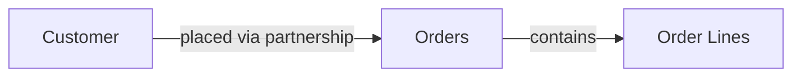
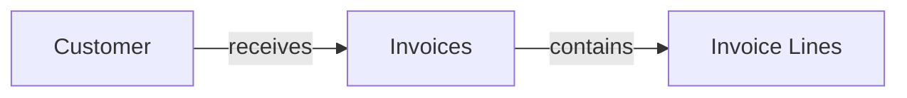

## Overview

Customers represent the companies or individuals you sell products and services to. In Pollinate, the Customers API is a simplified REST interface that abstracts the underlying **Partners and Partnerships** data model. The API automatically manages the `partnershipType = "customer"` classification, flattening both Partner and Partnership data into a single clean customer object with nested locations and contacts.

Each customer has:
- **Basic information** - Name, legal name, code, notes, contact details
- **Partnership details** - Status, payment terms, credit limits, currency preferences
- **Locations** - Multiple shipping, billing, and remittance addresses
- **Contacts** - Multiple people with different roles and preferences
- **Properties** - Custom JSONB metadata at customer, location, and contact levels

## Customer Architecture

Customers are built on top of two underlying entities:

```
Partner (base entity)
├── name, legalName, code, notes
├── email, phone, website
│
Partnership (type = "customer")
├── status, paymentTermsDays, creditLimit
├── defaultCurrency, leadTimeDays, minimumOrderValue
└── properties (JSONB)
```

The Customers API presents these as a single flattened object with nested relations:

```
Customer
├── Partner fields (flattened)
├── Partnership fields (flattened)
├── Locations[] (nested, owned by partner)
├── Contacts[] (nested, owned by partner)
└── Properties (at customer, location, and contact levels)
```

## Customer Status Workflow

Customers have a partnership status that indicates the relationship state:

```
pending → active ↔ on_hold
         ↓
      inactive, suspended, terminated
```

**Status Values:**

- `active` - Customer is actively trading
- `inactive` - Customer is not currently active
- `pending` - New customer, relationship not yet confirmed
- `on_hold` - Customer account is temporarily suspended
- `suspended` - Customer account is formally suspended
- `terminated` - Customer relationship has ended

<Note>
Status values can be used for filtering and reporting on customer relationships.
</Note>

## Locations and Contacts

Locations and contacts are nested sub-resources within customers. They don't have separate endpoints - you manage them as part of the customer object using intelligent diffing.

### Location Types

Each location has a `type` that indicates its purpose:

- **billing** - Used for invoices and billing
- **shipping** - Used for order delivery
- **remittance** - Used for payment remittances

### Contact Roles

Contacts can have a `role` to indicate their function:

- **primary** - Main contact person
- **sales** - Sales department contact
- **accounting** - Accounting/finance contact
- **logistics** - Shipping/logistics contact
- **executive** - Executive/management contact

### Example Customer Structure

```json
{
  "id": "par_xyz123",
  "organizationId": "org_123",
  "partnershipId": "pship_abc456",
  "name": "Acme Manufacturing Corp",
  "legalName": "Acme Manufacturing Corporation Inc.",
  "code": "ACME-001",
  "email": "orders@acme.com",
  "phone": "+1-555-0100",
  "website": "https://acme.com",
  "status": "active",
  "paymentTermsDays": 30,
  "creditLimit": 250000,
  "defaultCurrency": "USD",
  "leadTimeDays": 7,
  "minimumOrderValue": 1000,
  "properties": {
    "industry": "Manufacturing",
    "account_tier": "premium"
  },
  "locations": [
    {
      "id": "loc_456",
      "type": "billing",
      "label": "Headquarters",
      "addressLine1": "123 Industrial Blvd",
      "addressLine2": "Suite 200",
      "city": "Chicago",
      "state": "IL",
      "postalCode": "60601",
      "country": "USA",
      "isDefault": true,
      "properties": {
        "building_code": "HQ-001"
      }
    },
    {
      "id": "loc_789",
      "type": "shipping",
      "label": "Warehouse",
      "addressLine1": "456 Logistics Way",
      "city": "Indianapolis",
      "state": "IN",
      "country": "USA",
      "isDefault": false
    }
  ],
  "contacts": [
    {
      "id": "con_001",
      "name": "John Doe",
      "title": "Procurement Director",
      "role": "primary",
      "isPrimary": true,
      "email": "john@acme.com",
      "phone": "+1-555-0101",
      "properties": {
        "preferred_contact_method": "email"
      }
    },
    {
      "id": "con_002",
      "name": "Jane Smith",
      "title": "Accounts Manager",
      "role": "accounting",
      "isPrimary": false,
      "email": "jane@acme.com"
    }
  ]
}
```

## Common Use Cases

### 1. Customer Relationship Management

Maintain comprehensive customer information:

- Store multiple shipping and billing addresses
- Track different contacts for different purposes
- Manage customer-specific payment terms and credit limits
- Store custom metadata and integration IDs

### 2. Order Management

Use customer data when creating orders:

- Link orders to customer partnerships
- Auto-populate delivery addresses from customer locations
- Route orders to appropriate contacts
- Apply customer-specific payment terms

### 3. Invoicing

Link invoices to customers with proper billing information:

- Generate invoices with correct billing addresses
- Send invoices to appropriate accounting contacts
- Track accounts receivable by customer partnership

## Relationships

### Customers → Orders

Customers are linked to orders, enabling you to track sales and order history.



### Customers → Invoices

Customers receive invoices for purchases, connecting sales to financial records.



## Intelligent Diffing Algorithm

When updating a customer, the API uses intelligent matching to determine which locations and contacts to create, update, or delete.

### Location Diffing

**Matching Priority:**

1. **By ID** - If the location includes an `id`, it matches directly to an existing location
2. **By Label** - If the location includes a `label`, it matches case-insensitively with existing locations
3. **Create** - Locations without a match are created as new
4. **Delete** - Existing locations without a match in the request are deleted

**Example:**

```json
Existing locations:
- id: loc_1, label: "HQ", city: "NYC"
- id: loc_2, label: "Warehouse", city: "NJ"

PATCH request:
- id: loc_1, city: "Boston"  → UPDATED (matched by ID)
- label: "warehouse", city: "Princeton"  → UPDATED (matched by label, case-insensitive)
- label: "New DC", city: "PA"  → CREATED (no match)

Result:
- loc_1: Updated (city NYC → Boston)
- loc_2: Updated (matched by "warehouse" = "Warehouse")
- New location created (New DC in PA)
```

### Contact Diffing

**Matching Priority:**

1. **By ID** - If the contact includes an `id`, it matches directly to an existing contact
2. **By Name** - If the contact includes a `name`, it matches case-insensitively with existing contacts
3. **Create** - Contacts without a match are created as new
4. **Delete** - Existing contacts without a match in the request are deleted

**Example:**

```json
Existing contacts:
- id: con_1, name: "John Doe", role: "primary"
- id: con_2, name: "Jane Smith", role: "accounting"

PATCH request:
- id: con_1, phone: "+1-555-9999"  → UPDATED (matched by ID)
- name: "jane smith", phone: "+1-555-8888"  → UPDATED (matched by name, case-insensitive)
- name: "Bob Wilson", role: "sales"  → CREATED (no match)

Result:
- con_1: Updated (phone added)
- con_2: Updated (matched by "jane smith" = "Jane Smith")
- New contact created (Bob Wilson)
```

## Properties Merge Behavior

Properties are custom JSONB objects that can store flexible key-value data. Properties exist at three levels:
- **Customer Level** - On the partnership record
- **Location Level** - On each location
- **Contact Level** - On each contact

When updating, properties are merged intelligently:

- **Add new keys** - Provide new property keys that don't exist
- **Update existing keys** - Provide a key with a new value
- **Delete keys** - Set a property key to `null` to delete it

### Example Flow

```javascript
// Initial properties
{
  "industry": "Manufacturing",
  "region": "North America",
  "account_tier": "gold"
}

// Merge request
{
  "properties": {
    "account_tier": "platinum",  // Update
    "region": null,              // Delete
    "verified": true             // Add
  }
}

// Result
{
  "industry": "Manufacturing",   // Preserved
  "account_tier": "platinum",    // Updated
  "verified": true               // Added
  // region deleted
}
```

## Example Workflows

### Creating a Customer with Full Details

Create a customer with all information in one request:

```json
POST /customers
{
  "name": "Acme Manufacturing Corp",
  "legalName": "Acme Manufacturing Corporation Inc.",
  "code": "ACME-001",
  "email": "orders@acme.com",
  "phone": "+1-555-0100",
  "website": "https://acme.com",
  "status": "active",
  "paymentTermsDays": 30,
  "creditLimit": 250000,
  "defaultCurrency": "USD",
  "leadTimeDays": 7,
  "minimumOrderValue": 1000,
  "properties": {
    "industry": "Manufacturing",
    "account_tier": "premium"
  },
  "locations": [
    {
      "type": "billing",
      "isDefault": true,
      "label": "Headquarters",
      "addressLine1": "123 Industrial Blvd",
      "city": "Chicago",
      "state": "IL",
      "country": "USA"
    }
  ],
  "contacts": [
    {
      "name": "John Doe",
      "title": "Procurement Director",
      "role": "primary",
      "isPrimary": true,
      "email": "john@acme.com"
    }
  ]
}
```

### Updating Locations with Label Matching

Update a location by matching its user-friendly label:

```json
PATCH /customers/par_abc123
{
  "locations": [
    {
      "label": "headquarters",
      "city": "New York",
      "state": "NY",
      "addressLine1": "999 Park Ave",
      "country": "USA"
    }
  ]
}
```

The system finds the location with label "Headquarters" (case-insensitive) and updates it.

### Adding a New Location

Include existing locations and the new one:

```json
PATCH /customers/par_abc123
{
  "locations": [
    {
      "id": "loc_existing_123",
      "label": "Headquarters",
      "city": "Chicago",
      "addressLine1": "123 Industrial Blvd",
      "country": "USA"
    },
    {
      "type": "shipping",
      "label": "Distribution Center",
      "addressLine1": "456 Logistics Way",
      "city": "Indianapolis",
      "country": "USA"
    }
  ]
}
```

### Updating Properties

Add, update, and delete properties in one request:

```json
PATCH /customers/par_abc123
{
  "properties": {
    "account_tier": "enterprise",      // Update
    "renewal_date": "2024-12-31",      // Add
    "legacy_id": null                  // Delete
  }
}
```

### Complex Multi-Resource Update

Update customer details, manage locations, manage contacts, and update properties all at once:

```json
PATCH /customers/par_abc123
{
  "name": "Acme Manufacturing Ltd",
  "status": "on_hold",
  "properties": {
    "reason_on_hold": "Credit review",
    "on_hold_date": "2024-03-01",
    "review_required": null
  },
  "locations": [
    {
      "id": "loc_existing_123",
      "city": "Boston",
      "addressLine1": "100 Newbury St"
    },
    {
      "type": "shipping",
      "label": "New Warehouse",
      "addressLine1": "200 Logistics Dr",
      "city": "Newark",
      "state": "NJ",
      "country": "USA"
    }
  ],
  "contacts": [
    {
      "id": "con_existing_456",
      "phone": "+1-555-9999"
    },
    {
      "name": "Jane Smith",
      "role": "sales",
      "email": "jane@acme.com"
    }
  ]
}
```

## Filtering and Sorting

### List Customers by Status

```bash
curl -X GET "https://api.example.com/customers?status=active" \
  -H "Authorization: Bearer YOUR_TOKEN" \
  -H "x-org-id: org_xxxx"
```

### Pagination

```bash
# Get first 20 customers
curl -X GET "https://api.example.com/customers?limit=20&offset=0" \
  -H "Authorization: Bearer YOUR_TOKEN" \
  -H "x-org-id: org_xxxx"

# Get next 20 customers
curl -X GET "https://api.example.com/customers?limit=20&offset=20" \
  -H "Authorization: Bearer YOUR_TOKEN" \
  -H "x-org-id: org_xxxx"
```

### Sorting

```bash
# Sort by name (ascending)
curl -X GET "https://api.example.com/customers?sort=name&direction=asc" \
  -H "Authorization: Bearer YOUR_TOKEN" \
  -H "x-org-id: org_xxxx"

# Sort by creation date (newest first)
curl -X GET "https://api.example.com/customers?sort=createdAt&direction=desc" \
  -H "Authorization: Bearer YOUR_TOKEN" \
  -H "x-org-id: org_xxxx"
```

## Best Practices

<Tip>
**Partnership Abstraction**: The Customers API automatically handles the underlying partnership creation. You don't need to manage partnerships directly - just use the Customers endpoints.
</Tip>

<Tip>
**Location Labels**: Use descriptive labels (e.g., "Headquarters", "Warehouse", "Distribution Center") to make locations easy to identify and update by label.
</Tip>

<Tip>
**Case-Insensitive Matching**: Location labels and contact names are matched case-insensitively, so "HQ" matches "hq" and "John Doe" matches "john doe".
</Tip>

<Tip>
**Batch Operations**: Prefer single PATCH requests with all location/contact changes over multiple sequential requests. Parallel execution reduces total time.
</Tip>

<Tip>
**Property Merge Pattern**: Set unwanted properties to `null` to delete them. New properties are automatically added. No need to send the full property object on every update.
</Tip>

<Warning>
**Sub-resource Deletion**: When updating customers, locations and contacts not included in the request will be deleted. Always include all sub-resources you want to preserve.
</Warning>

<Warning>
**Soft Deletes**: Deleted customers aren't removed from the database - they're marked with a `deletedAt` timestamp and excluded from queries.
</Warning>

## Next Steps

- Learn about [Partners](/guides/partners) - The underlying model powering customers
- Understand how customers are used in [Orders](/guides/orders)
- Review [Invoices](/guides/invoices) and customer billing relationships
- Explore [Suppliers](/guides/suppliers) - The parallel implementation for supplier relationships