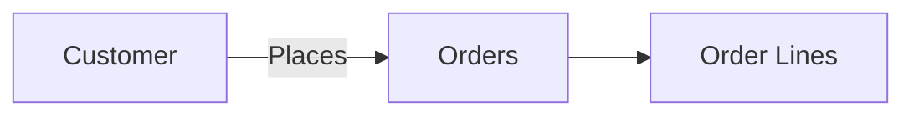
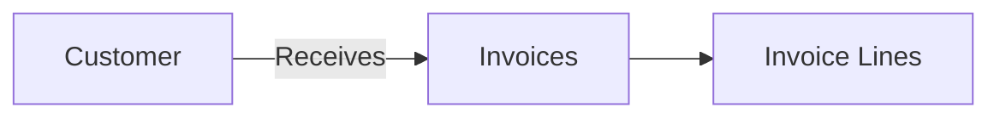

## Overview

Customers represent the companies or individuals you sell products and services to. In Pollinate, customers are technically **partners** (see the [Partners guide](/guides/partners) for more details), which means they can have multiple locations and contacts associated with them.

## Customer Structure

```
Customer (Partner)
├── Basic Information (name, company, tax ID)
├── Locations (shipping, billing addresses)
│   ├── Location 1
│   ├── Location 2
│   └── Location 3
└── Contacts (people, roles, email, phone)
    ├── Contact 1
    ├── Contact 2
    └── Contact 3
```

## Locations and Contacts

Locations and contacts are sub-resources nested within customers. They don't have separate endpoints - you manage them as part of the customer object.

<Note>
When creating or updating a customer, include locations and contacts directly in the request body. The API uses unique constraints to determine whether to create, update, or delete these sub-resources.
</Note>

### Example Customer with Locations and Contacts

```json
{
  "name": "Acme Corporation",
  "company": "Acme Corp",
  "taxId": "TAX123456",
  "locations": [
    {
      "name": "Main Office",
      "address": "123 Business St",
      "city": "San Francisco",
      "state": "CA",
      "zipCode": "94105",
      "country": "USA",
      "type": "billing"
    },
    {
      "name": "Warehouse",
      "address": "456 Industrial Ave",
      "city": "Oakland",
      "state": "CA",
      "zipCode": "94601",
      "country": "USA",
      "type": "shipping"
    }
  ],
  "contacts": [
    {
      "name": "John Doe",
      "email": "john@acme.com",
      "phone": "+1-555-0100",
      "role": "Purchasing Manager"
    },
    {
      "name": "Jane Smith",
      "email": "jane@acme.com",
      "phone": "+1-555-0101",
      "role": "Accounts Payable"
    }
  ]
}
```

## Common Use Cases

### 1. Customer Relationship Management

Maintain comprehensive customer information:

- Store multiple shipping and billing addresses
- Track different contacts for different purposes
- Manage customer-specific pricing or terms

### 2. Order Management

Use customer data when creating orders:

- Automatically populate shipping addresses
- Route orders to appropriate contacts
- Track order history by customer

### 3. Invoice Processing

Link invoices to customers with proper billing information:

- Generate invoices with correct billing addresses
- Send invoices to appropriate contacts
- Track accounts receivable by customer

## Relationships

### Customers → Orders

Customers are linked to orders, enabling you to track sales and order history.



### Customers → Invoices

Customers receive invoices for purchases, connecting sales to financial records.



## Example Workflows

### Creating a Customer with Locations and Contacts

1. **Create the customer** with all related information:

```json
POST /customers
{
  "name": "Tech Solutions Inc",
  "company": "Tech Solutions",
  "locations": [
    {
      "name": "Headquarters",
      "address": "789 Tech Blvd",
      "city": "Seattle",
      "state": "WA",
      "zipCode": "98101",
      "type": "billing"
    }
  ],
  "contacts": [
    {
      "name": "Bob Johnson",
      "email": "bob@techsolutions.com",
      "role": "Procurement"
    }
  ]
}
```

2. The API creates the customer, locations, and contacts in a single request.

### Adding a New Location

Update the customer to include additional locations:

```json
PATCH /customers/{id}
{
  "locations": [
    {
      "name": "Headquarters",  // Existing - will be updated/preserved
      "address": "789 Tech Blvd",
      "city": "Seattle",
      "state": "WA",
      "zipCode": "98101",
      "type": "billing"
    },
    {
      "name": "Distribution Center",  // New - will be created
      "address": "321 Logistics Way",
      "city": "Tacoma",
      "state": "WA",
      "zipCode": "98402",
      "type": "shipping"
    }
  ]
}
```

### Updating Contacts

When updating contacts, include all contacts you want to keep:

```json
PATCH /customers/{id}
{
  "contacts": [
    {
      "name": "Bob Johnson",  // Existing - will be updated
      "email": "bob.newemail@techsolutions.com",  // Updated email
      "role": "Procurement"
    },
    {
      "name": "Alice Williams",  // New - will be created
      "email": "alice@techsolutions.com",
      "role": "Accounts Payable"
    }
    // Previous contacts not included will be deleted
  ]
}
```

## Best Practices

<Tip>
**Location Naming**: Use descriptive names for locations (e.g., "Headquarters", "Warehouse - East", "Retail Store #1") to make them easy to identify.
</Tip>

<Tip>
**Contact Roles**: Use consistent role names (e.g., "Purchasing Manager", "Accounts Payable", "Shipping Contact") to standardize how contacts are used.
</Tip>

<Tip>
**Complete Updates**: When updating customers, always send the complete list of locations and contacts you want to keep. Missing items will be deleted.
</Tip>

<Warning>
**Sub-resource Deletion**: Be careful when updating customers - locations and contacts not included in a PATCH request will be deleted. Always include all sub-resources you want to preserve.
</Warning>

## Next Steps

- Learn about the [Partners](/guides/partners) model that connects customers and suppliers
- Understand how customers are used in [Orders](/guides/orders)
- Review [Invoices](/guides/invoices) and customer billing relationships
