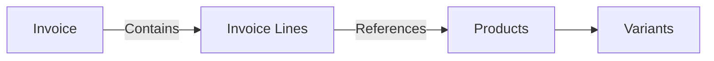
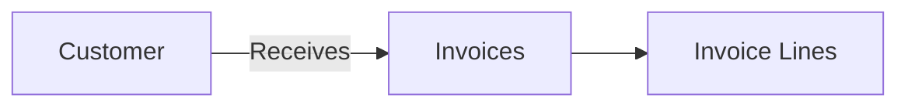
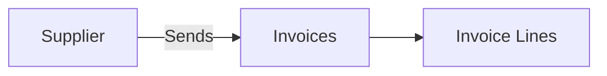
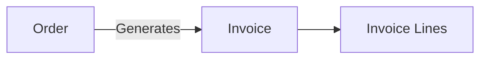

## Overview

Invoices represent bills or receipts for products and services. In Pollinate, invoices contain **invoice lines**, which specify the individual products, quantities, and amounts for each item on the invoice. Invoices can be linked to customers (for sales) or suppliers (for purchases).

## Invoice Structure

```
Invoice
├── Basic Information (invoice number, date, due date)
├── Customer or Supplier Reference
├── Invoice Lines (products, quantities, amounts)
│   ├── Line 1 (Product + Variant)
│   ├── Line 2 (Product + Variant)
│   └── Line 3 (Product + Variant)
├── Financial Details (subtotal, tax, total)
└── Metadata (payment terms, status, custom fields)
```

## Invoice Lines

Invoice lines are nested within invoices and don't have separate endpoints. Each line item references a product (and optionally a variant) and includes quantity, pricing, and other invoice-specific details.

<Note>
When creating or updating an invoice, include invoice lines directly in the request body. The API uses unique constraints to determine whether to create, update, or delete invoice lines.
</Note>

### Example Invoice with Invoice Lines

```json
{
  "invoiceNumber": "INV-2024-001",
  "date": "2024-01-20",
  "dueDate": "2024-02-19",
  "customerId": "cust_123456",
  "status": "pending",
  "invoiceLines": [
    {
      "productId": "prod_789",
      "variantName": "Large - Red",
      "quantity": 10,
      "unitPrice": 21.99,
      "totalPrice": 219.90
    },
    {
      "productId": "prod_456",
      "quantity": 2,
      "unitPrice": 49.99,
      "totalPrice": 99.98
    }
  ],
  "subtotal": 319.88,
  "tax": 25.59,
  "totalAmount": 345.47,
  "paymentTerms": "Net 30"
}
```

## Common Use Cases

### 1. Sales Invoicing (Accounts Receivable)

Generate and track customer invoices:

- Create invoices from orders
- Track payment status
- Manage accounts receivable
- Generate statements and reminders

### 2. Purchase Invoicing (Accounts Payable)

Receive and process supplier invoices:

- Record supplier invoices
- Match invoices to purchase orders
- Track payment due dates
- Manage accounts payable workflow

### 3. Financial Reporting

Use invoice data for accounting and reporting:

- Revenue recognition
- Cost tracking
- Tax calculations
- Financial statements

### 4. Payment Processing

Link invoices to payment workflows:

- Track payment status
- Record partial payments
- Handle payment matching
- Generate payment reports

## Relationships

### Invoices → Products

Invoices reference products through invoice lines, connecting billing to your product catalog.



### Invoices → Customers

Sales invoices are linked to customers for accounts receivable tracking.



### Invoices → Suppliers

Purchase invoices are linked to suppliers for accounts payable tracking.



### Invoices → Orders

Invoices can be linked to orders to track the order-to-invoice flow.



## Example Workflows

### Creating a Customer Invoice

1. **Create the invoice** with all invoice lines:

```json
POST /invoices
{
  "invoiceNumber": "INV-2024-002",
  "date": "2024-01-21",
  "dueDate": "2024-02-20",
  "customerId": "cust_123456",
  "status": "pending",
  "invoiceLines": [
    {
      "productId": "prod_123",
      "variantName": "Standard",
      "quantity": 20,
      "unitPrice": 29.99,
      "totalPrice": 599.80
    },
    {
      "productId": "prod_456",
      "quantity": 5,
      "unitPrice": 99.99,
      "totalPrice": 499.95
    }
  ],
  "subtotal": 1099.75,
  "tax": 87.98,
  "totalAmount": 1187.73,
  "paymentTerms": "Net 30"
}
```

2. The API creates the invoice and all invoice lines in a single request.

### Creating a Supplier Invoice

For accounts payable (supplier invoices):

```json
POST /invoices
{
  "invoiceNumber": "SUP-INV-2024-001",
  "date": "2024-01-22",
  "dueDate": "2024-02-21",
  "supplierId": "supp_789012",
  "status": "pending",
  "invoiceLines": [
    {
      "productId": "prod_999",
      "quantity": 100,
      "unitPrice": 5.50,
      "totalPrice": 550.00
    }
  ],
  "subtotal": 550.00,
  "tax": 44.00,
  "totalAmount": 594.00,
  "paymentTerms": "Net 30"
}
```

### Updating Invoice Lines

Modify invoice line items (before payment):

```json
PATCH /invoices/{id}
{
  "invoiceLines": [
    {
      "productId": "prod_123",
      "variantName": "Standard",
      "quantity": 25,  // Updated quantity
      "unitPrice": 29.99,
      "totalPrice": 749.75  // Updated total
    }
    // Previous prod_456 line not included - will be deleted
  ],
  "subtotal": 749.75,
  "tax": 59.98,
  "totalAmount": 809.73
}
```

### Updating Invoice Status

Track payment status:

```json
PATCH /invoices/{id}
{
  "status": "paid",
  "paidDate": "2024-01-25",
  "paymentMethod": "wire_transfer"
}
```

## Invoice Status Workflow

Typical invoice status progression:

**Sales Invoices (Accounts Receivable):**
```
pending → sent → partially_paid → paid
         ↓
      overdue
```

**Purchase Invoices (Accounts Payable):**
```
pending → approved → scheduled → paid
         ↓
      disputed
```

<Note>
Invoice status values and workflow may vary based on your business needs. Check with your Pollinate administrator for available status values.
</Note>

## Best Practices

<Tip>
**Invoice Numbering**: Use consistent invoice number formats (e.g., "INV-YYYY-NNNN" for sales, "SUP-INV-YYYY-NNNN" for purchases) to distinguish invoice types.
</Tip>

<Tip>
**Line Item References**: Always reference products by their ID and include variant names when applicable to ensure accurate billing.
</Tip>

<Tip>
**Payment Terms**: Set clear payment terms (e.g., "Net 30", "Due on Receipt") and track due dates for cash flow management.
</Tip>

<Tip>
**Complete Updates**: When updating invoices, include all invoice lines you want to keep. Missing lines will be deleted.
</Tip>

<Warning>
**Invoice Line Deletion**: Be careful when updating invoices - invoice lines not included in a PATCH request will be deleted. For paid invoices, consider creating credit memos instead of modifying the original invoice.
</Warning>

<Warning>
**Invoice Modifications**: Once an invoice is paid or in certain statuses, modifications may be restricted. Check your organization's policies before updating invoices.
</Warning>

## Next Steps

- Learn about [Orders](/guides/orders) and how they relate to invoices
- Understand [Products](/guides/products) referenced in invoice lines
- Review how [Customers](/guides/customers) and [Suppliers](/guides/suppliers) are linked to invoices
