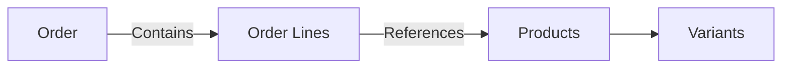
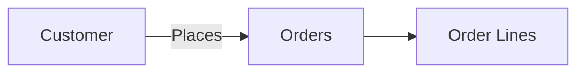
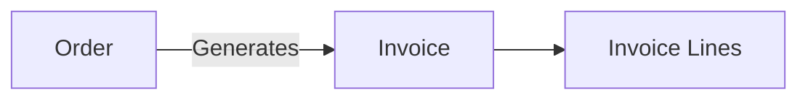

## Overview

Orders represent transactions where products are purchased or sold. In Pollinate, orders contain **order lines**, which specify the individual products (and variants), quantities, and pricing for each item in the order.

## Order Structure

```
Order
├── Basic Information (order number, date, status)
├── Customer Reference
├── Order Lines (products, quantities, prices)
│   ├── Line 1 (Product + Variant)
│   ├── Line 2 (Product + Variant)
│   └── Line 3 (Product + Variant)
└── Metadata (shipping info, notes, custom fields)
```

## Order Lines

Order lines are nested within orders and don't have separate endpoints. Each line item references a product (and optionally a variant) and includes quantity, pricing, and other order-specific details.

<Note>
When creating or updating an order, include order lines directly in the request body. The API uses unique constraints to determine whether to create, update, or delete order lines.
</Note>

### Example Order with Order Lines

```json
{
  "orderNumber": "ORD-2024-001",
  "date": "2024-01-15",
  "status": "pending",
  "customerId": "cust_123456",
  "orderLines": [
    {
      "productId": "prod_789",
      "variantName": "Large - Red",
      "quantity": 10,
      "unitPrice": 21.99,
      "totalPrice": 219.90
    },
    {
      "productId": "prod_789",
      "variantName": "Medium - Blue",
      "quantity": 5,
      "unitPrice": 19.99,
      "totalPrice": 99.95
    },
    {
      "productId": "prod_456",
      "quantity": 2,
      "unitPrice": 49.99,
      "totalPrice": 99.98
    }
  ],
  "shippingAddress": {
    "name": "Main Warehouse",
    "address": "123 Business St",
    "city": "San Francisco",
    "state": "CA",
    "zipCode": "94105"
  },
  "totalAmount": 419.83
}
```

## Common Use Cases

### 1. Sales Order Processing

Manage the complete sales order lifecycle:

- Create orders from customer requests
- Track order status (pending, processing, shipped, completed)
- Link orders to customer records
- Generate order confirmations

### 2. Purchase Order Management

Handle procurement and purchasing:

- Create purchase orders from suppliers
- Track order fulfillment status
- Link orders to supplier records
- Manage receiving and invoicing

### 3. Order Fulfillment

Connect orders to fulfillment workflows:

- Generate pick lists from order lines
- Track inventory allocation
- Update order status as items ship
- Handle partial shipments

### 4. Reporting and Analytics

Analyze order data for insights:

- Sales trends by product or customer
- Order volume and revenue metrics
- Average order value calculations
- Seasonal ordering patterns

## Relationships

### Orders → Products

Orders reference products through order lines, creating a link between sales/purchases and your product catalog.



### Orders → Customers

Orders are linked to customers to track sales relationships and order history.



### Orders → Invoices

Orders can be converted to or linked with invoices for billing and payment tracking.



## Example Workflows

### Creating an Order

1. **Create the order** with all order lines:

```json
POST /orders
{
  "orderNumber": "ORD-2024-002",
  "date": "2024-01-16",
  "status": "pending",
  "customerId": "cust_123456",
  "orderLines": [
    {
      "productId": "prod_123",
      "variantName": "Standard",
      "quantity": 20,
      "unitPrice": 29.99,
      "totalPrice": 599.80
    },
    {
      "productId": "prod_456",
      "quantity": 5,
      "unitPrice": 99.99,
      "totalPrice": 499.95
    }
  ],
  "totalAmount": 1099.75
}
```

2. The API creates the order and all order lines in a single request.

### Updating Order Lines

When you need to modify an order, include all order lines you want to keep:

```json
PATCH /orders/{id}
{
  "orderLines": [
    {
      "productId": "prod_123",
      "variantName": "Standard",
      "quantity": 25,  // Updated quantity
      "unitPrice": 29.99,
      "totalPrice": 749.75  // Updated total
    },
    {
      "productId": "prod_789",  // New line item
      "variantName": "Large - Blue",
      "quantity": 3,
      "unitPrice": 39.99,
      "totalPrice": 119.97
    }
    // Previous prod_456 line not included - will be deleted
  ],
  "totalAmount": 869.72  // Updated total
}
```

### Changing Order Status

Update order status as it progresses through fulfillment:

```json
PATCH /orders/{id}
{
  "status": "processing"
}
```

Later:

```json
PATCH /orders/{id}
{
  "status": "shipped",
  "shippedDate": "2024-01-18",
  "trackingNumber": "TRACK123456"
}
```

## Order Status Workflow

Typical order status progression:

```
pending → processing → shipped → completed
         ↓
      cancelled
```

<Note>
Order status values and workflow may vary based on your business needs. Check with your Pollinate administrator for available status values.
</Note>

## Best Practices

<Tip>
**Order Numbering**: Use consistent order number formats (e.g., "ORD-YYYY-NNNN") to make orders easy to identify and reference.
</Tip>

<Tip>
**Line Item References**: Always reference products by their ID and include variant names when applicable to ensure accurate order processing.
</Tip>

<Tip>
**Complete Updates**: When updating orders, include all order lines you want to keep. Missing lines will be deleted, which may not be intended for active orders.
</Tip>

<Tip>
**Status Management**: Update order status consistently as orders move through your fulfillment process for accurate tracking and reporting.
</Tip>

<Warning>
**Order Line Deletion**: Be careful when updating orders - order lines not included in a PATCH request will be deleted. For active orders, consider adding new lines rather than replacing all lines.
</Warning>

## Next Steps

- Learn about [Invoices](/guides/invoices) and how orders relate to billing
- Understand [Products](/guides/products) referenced in order lines
- Review how [Customers](/guides/customers) are linked to orders
