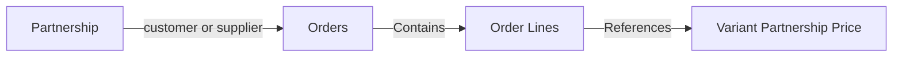
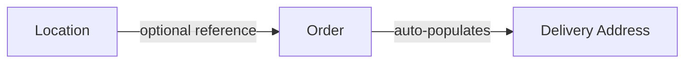

## Overview

Orders represent transactions where products are purchased or sold. In Pollinate, orders are partnerships-based (customer or supplier relationships) and contain **order lines**, which specify the individual products (variants), quantities, and pricing for each item in the order.

Orders support:
- **Intelligent line diffing** - Automatically match lines by ID, variant, or description
- **Flexible properties** - Custom JSONB objects for storing metadata
- **Multi-currency support** - Fallback hierarchy for currency resolution
- **Advanced filtering** - Status, partnership type, text search, and property filters
- **Soft deletes** - All deletions are marked with timestamps, not removed

## Order Structure

```
Order
├── Partnership Reference (customer or supplier)
├── Order References (internal, external, notes)
├── Delivery Information (address, location)
├── Financial Data (amount, currency)
├── Order Lines (products, quantities, prices)
│   ├── Line 1 (Variant + Properties)
│   ├── Line 2 (Variant + Properties)
│   └── Line 3 (Variant + Properties)
├── Custom Properties (metadata)
└── Lifecycle Timestamps (packed, shipped, delivered, returned)
```

## Order Lines

Order lines are nested within orders and don't have separate endpoints. Each line item can reference a variant partnership price (the price of a product variant for a specific partnership) or be created manually with a description and pricing. All lines include quantity, pricing, and optional properties.

<Note>
When creating or updating an order, include order lines directly in the request body. The API uses intelligent diffing to determine whether to create, update, or delete order lines based on matching by ID, variant, or description.
</Note>

### Order Line Creation Modes

Order lines can be created in two ways:

1. **Using Variant Partnership Price (VPP)**: Provide `variantPartnershipPriceId` to reference an existing price for a variant-partnership combination. The system will use the price from the VPP.

2. **Using Variant ID**: Provide `variantId` instead of `variantPartnershipPriceId`. The system will automatically resolve the variant ID to the appropriate Variant Partnership Price ID for the order's partnership. This is convenient when you know the variant but not the specific VPP ID.

3. **Manual Lines**: Create lines without a variant reference by providing `description`, `quantity`, and `unitPrice`. These are useful for custom items, services, or products not yet in your catalog.

<Warning>
You cannot provide both `variantId` and `variantPartnershipPriceId` in the same line. Use one or the other, or create a manual line.
</Warning>

### Example Order with Order Lines

```json
{
  "partnershipId": "pship_123456",
  "status": "pending",
  "internalReference": "ORG-001",
  "externalReference": "PO-12345",
  "notes": "Urgent delivery requested",
  "totalAmount": 1500.00,
  "currency": "USD",
  "deliveryAddress": {
    "addressLine1": "123 Main St",
    "addressLine2": "Suite 100",
    "city": "New York",
    "state": "NY",
    "postalCode": "10001",
    "country": "USA"
  },
  "properties": {
    "priority": "high",
    "region": "east",
    "warehouse": "Zone A"
  },
  "lines": [
    {
      "variantPartnershipPriceId": "vpp_789",
      "description": "Premium Widget",
      "quantity": 5,
      "unitPrice": 250.00,
      "lineTotal": 1250.00,
      "currency": "USD",
      "properties": {
        "warehouse": "Zone A",
        "expedited": true
      }
    },
    {
      "variantId": "prodvar_456",
      "quantity": 1,
      "unitPrice": 250.00,
      "lineTotal": 250.00,
      "currency": "USD"
    },
    {
      "description": "Custom Service Item",
      "quantity": 2,
      "unitPrice": 100.00,
      "lineTotal": 200.00,
      "currency": "USD"
    }
  ]
}
```

## Common Use Cases

### 1. Sales Order Processing

Manage the complete sales order lifecycle:

- Create orders from customer requests
- Track order status through fulfillment pipeline
- Link orders to customer partnerships
- Generate order confirmations and tracking

### 2. Purchase Order Management

Handle procurement and purchasing:

- Create purchase orders with suppliers
- Track order fulfillment status
- Link orders to supplier partnerships
- Manage receiving and invoicing

### 3. Order Fulfillment

Connect orders to fulfillment workflows:

- Generate pick lists from order lines
- Track inventory allocation
- Update order status as items are packed, shipped, and delivered
- Handle partial shipments and returns

### 4. Reporting and Analytics

Analyze order data for insights:

- Sales trends by product or partnership
- Order volume and revenue metrics
- Average order value calculations
- Partnership-based performance analysis

## Relationships

### Orders → Partnerships

Orders are linked to partnerships (customer or supplier) to track the relationship and enable filtering by partnership type.



### Orders → Locations

Orders can reference a location for automatic delivery address population.



## Order Status Workflow

Orders progress through the following statuses:

```
draft → pending → accepted → packed → shipped → delivered
         ↓
      rejected
         ↓
      cancelled → returned
```

**Status Descriptions:**

- `draft` - Order being prepared
- `pending` - Awaiting approval/processing
- `rejected` - Order rejected
- `accepted` - Order accepted/confirmed
- `packed` - Items packed and ready to ship
- `shipped` - Order shipped
- `delivered` - Delivered to recipient
- `cancelled` - Order cancelled
- `returned` - Items returned

<Note>
Order status values and workflow may vary based on your business needs. Check with your Pollinate administrator for available status values.
</Note>

## Intelligent Line Diffing

When updating an order, the API uses intelligent line matching to determine which lines to create, update, or delete:

### Matching Priority

1. **By ID** - If the line includes an `id`, it matches directly to an existing line
2. **By Variant Partnership Price** - If the line includes `variantPartnershipPriceId`, it searches for an existing line with the same VPP
3. **By Variant ID** - If the line includes `variantId`, it resolves to the VPP and matches by that VPP (same as priority 2)
4. **By Description** - If the line includes a `description`, it matches case-insensitively with existing lines
5. **Create** - Lines without a match are created as new
6. **Delete** - Existing lines without a match in the request are deleted

### Example

```json
Existing lines:
- ID: line_001, Description: "Standard Widget", VPP: vpp_123
- ID: line_002, Description: "Premium Widget", VPP: vpp_456

PATCH Request:
- ID: line_001, Quantity: 10  → UPDATED (matched by ID)
- Description: "PREMIUM WIDGET", Quantity: 5  → UPDATED (matched by description, case-insensitive)
- Description: "New Item", Quantity: 2  → CREATED (no match)

Result:
- line_001: Updated
- line_002: Updated (matched by description)
- New line: Created
```

## Properties Merge Behavior

Properties are custom JSONB objects that store flexible key-value data. When updating, properties are merged intelligently:

### Merge Operations

- **Add new keys** - Provide new property keys that don't exist
- **Update existing keys** - Provide a key with a new value
- **Delete keys** - Set a property key to `null`

### Example Flow

```javascript
// Initial properties
{
  "priority": "high",
  "region": "west",
  "warehouse": "A1"
}

// Merge request
{
  "properties": {
    "shipmentMethod": "express",  // Add new key
    "carrier": "FedEx"             // Add new key
  }
}

// Result
{
  "priority": "high",              // Preserved
  "region": "west",                // Preserved
  "warehouse": "A1",               // Preserved
  "shipmentMethod": "express",     // Added
  "carrier": "FedEx"               // Added
}

// Next merge
{
  "properties": {
    "priority": "urgent",          // Update value
    "warehouse": null              // Delete key
  }
}

// Final result
{
  "priority": "urgent",            // Updated
  "region": "west",                // Preserved
  "shipmentMethod": "express",     // Preserved
  "carrier": "FedEx",              // Preserved
  // warehouse deleted
}
```

This merge behavior applies to both order-level and line-level properties.

## Currency Fallback Logic

When creating or updating order lines, the system uses a priority-based fallback for currency determination:

```
1. Line-level currency (if provided)
2. Order-level currency (if provided)
3. Partnership default currency (if available)
4. USD (final fallback)
```

### Example Scenarios

```javascript
// Scenario 1: Line has currency
Line currency: "EUR"
Order currency: "USD"
Partnership defaultCurrency: "GBP"
Result: "EUR" ✓

// Scenario 2: Only order has currency
Line currency: undefined
Order currency: "CAD"
Partnership defaultCurrency: "GBP"
Result: "CAD" ✓

// Scenario 3: Only partnership has currency
Line currency: undefined
Order currency: undefined
Partnership defaultCurrency: "JPY"
Result: "JPY" ✓

// Scenario 4: No currency specified anywhere
Line currency: undefined
Order currency: undefined
Partnership defaultCurrency: undefined
Result: "USD" ✓
```

## Example Workflows

### Creating an Order

1. **Create the order** with all order lines:

```json
POST /orders
{
  "partnershipId": "pship_456",
  "status": "pending",
  "internalReference": "ORG-002",
  "externalReference": "PO-98765",
  "notes": "Standard order",
  "totalAmount": "1500.00",
  "currency": "USD",
  "deliveryAddress": {
    "addressLine1": "456 Oak Ave",
    "city": "Los Angeles",
    "state": "CA",
    "postalCode": "90001",
    "country": "USA"
  },
  "lines": [
    {
      "variantId": "prodvar_123",
      "quantity": 20
    },
    {
      "variantPartnershipPriceId": "vpp_456",
      "quantity": 5
    },
    {
      "description": "Custom Item",
      "quantity": 2,
      "unitPrice": 50.00
    }
  ]
}
```

2. The API creates the order and all order lines in a single request. When using `variantId`, the system automatically resolves it to the appropriate Variant Partnership Price ID for the partnership.

### Updating Order Lines

When you need to modify an order, use intelligent line diffing:

```json
PATCH /orders/ord_12345
{
  "lines": [
    {
      "id": "ordline_001",
      "quantity": 25,  // Updated quantity
      "unitPrice": 75.00
    },
    {
      "variantId": "prodvar_789",  // New line using variantId (will be resolved to VPP)
      "quantity": 3
    },
    {
      "variantPartnershipPriceId": "vpp_456",  // New line using VPP directly
      "quantity": 2
    }
    // Previous lines not included will be deleted
  ]
}
```

### Changing Order Status

Update order status as it progresses through fulfillment:

```json
PATCH /orders/ord_12345
{
  "status": "accepted"
}
```

Later:

```json
PATCH /orders/ord_12345
{
  "status": "packed"
}
```

And finally:

```json
PATCH /orders/ord_12345
{
  "status": "shipped"
}
```

### Adding Order Properties

Store custom metadata on orders:

```json
PATCH /orders/ord_12345
{
  "properties": {
    "priority": "high",
    "region": "west",
    "warehouse": "A1"
  }
}
```

Update specific properties while preserving others:

```json
PATCH /orders/ord_12345
{
  "properties": {
    "priority": "urgent",  // Update
    "warehouse": null      // Delete
  }
}
```

## Partnership Types

Orders are associated with partnerships, which have types:

- **Customer Orders** - Orders TO your customers (sales)
- **Supplier Orders** - Orders FROM your suppliers (purchases)

Filter orders by partnership type:

```bash
# Get customer orders only
curl -X GET "https://api.example.com/orders?partnershipType=customer"

# Get supplier orders only
curl -X GET "https://api.example.com/orders?partnershipType=supplier"
```

## Filtering Orders

### By Status

```bash
curl -X GET "https://api.example.com/orders?status=pending"
```

### By Partnership Type

```bash
curl -X GET "https://api.example.com/orders?partnershipType=customer"
```

### By Text Search

Search across order references and notes:

```bash
curl -X GET "https://api.example.com/orders?search=PO-12345"
```

### By Properties

Filter using custom properties with dot notation:

```bash
# Filter by exact property value
curl -X GET "https://api.example.com/orders?propertiesPath=priority&propertiesValue=high"

# Filter by nested property
curl -X GET "https://api.example.com/orders?propertiesPath=metadata.warehouse&propertiesValue=Zone%20A"

# Filter by property existence
curl -X GET "https://api.example.com/orders?propertiesPath=region&propertiesExists=true"
```

## Pagination & Sorting

### Pagination

```bash
# Get first 20 orders
curl -X GET "https://api.example.com/orders?limit=20&offset=0"

# Get next 20 orders
curl -X GET "https://api.example.com/orders?limit=20&offset=20"
```

### Sorting

```bash
# Sort by creation date (newest first)
curl -X GET "https://api.example.com/orders?sort=createdAt&direction=desc"

# Sort by updated date (oldest first)
curl -X GET "https://api.example.com/orders?sort=updatedAt&direction=asc"
```

## Best Practices

<Tip>
**Internal References**: The system auto-generates unique order references with your organization prefix (e.g., "ORG-001"). You can provide a custom `internalReference` to override this.
</Tip>

<Tip>
**Delivery Address**: If you don't provide a custom `deliveryAddress`, you can link a `locationId` for automatic population from that location's address.
</Tip>

<Tip>
**Line Item Matching**: Include line IDs when you know them to ensure precise matching during updates. Use descriptions or variant IDs as fallbacks.
</Tip>

<Tip>
**Complete Updates**: When updating orders, decide whether to include all lines (which will delete missing ones) or update specific lines by ID.
</Tip>

<Warning>
**Soft Deletes**: Orders aren't removed from the database when deleted - they're marked with a `deletedAt` timestamp. They won't appear in list queries by default.
</Warning>

<Warning>
**Line Deletion**: Be careful with line updates - lines not included in a PATCH request will be deleted. For critical orders, update specific lines by ID rather than replacing all lines.
</Warning>

## Next Steps

- Learn about [Invoices](/guides/invoices) and how orders relate to billing
- Understand [Products](/guides/products) and variants referenced in order lines
- Review how [Partnerships](/guides/partners) connect to orders
