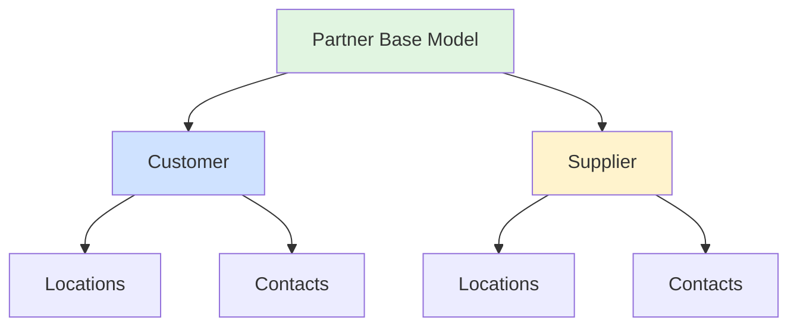

## Overview

In Pollinate's data model, both **Customers** and **Suppliers** are implemented as **Partners**. This unified approach allows for consistent handling of business relationships, locations, and contacts across your supply chain.

## The Partner Concept

<Note>
While the API has separate endpoints for `/customers` and `/suppliers`, they share the same underlying data structure as partners. This design enables flexibility in how you model business relationships.
</Note>

## Shared Structure

Both customers and suppliers share these common features:

### 1. Basic Information

- Company name
- Tax identification numbers
- Business registration details
- Custom metadata

### 2. Locations

Both customers and suppliers can have multiple locations:

- **Shipping addresses** - Where goods are delivered or sent from
- **Billing addresses** - Where invoices are sent or received
- **Remit-to addresses** - Where payments should be sent
- Custom location types based on your needs

### 3. Contacts

Both can have multiple contacts with different roles:

- Sales representatives
- Purchasing managers
- Accounts payable contacts
- Shipping coordinators
- Custom roles for your workflow

## Why Partners Matter

### Consistent API Patterns

Because customers and suppliers share the partner model, the API patterns are identical:

- Same structure for locations and contacts
- Same nested resource handling
- Same PATCH diffing logic
- Same query parameters and pagination

### Flexible Relationships

The partner model enables complex business relationships:

- A company might be both a customer and a supplier
- Locations can be shared or separate
- Contacts can have multiple roles
- Relationships can evolve over time

### Simplified Integration

Using a consistent model makes integration easier:

- Reuse the same data structures
- Share code between customer and supplier handling
- Maintain consistent workflows
- Reduce API complexity

## Location Patterns

### Customer Locations

Customers typically use locations for:

- **Shipping**: Where to deliver orders
- **Billing**: Where to send invoices
- **Service**: Where services are performed

### Supplier Locations

Suppliers typically use locations for:

- **Shipping**: Where orders ship from
- **Billing/Remit-to**: Where to send payments
- **Receiving**: Where to send returns

### Shared Patterns

Both use locations for:

- Multiple warehouse or office locations
- Seasonal or temporary locations
- Location-specific pricing or terms
- Geographic routing and optimization

## Contact Patterns

### Customer Contacts

Common customer contact roles:

- Purchasing Manager
- Accounts Payable
- Shipping Contact
- End User / Buyer
- Decision Maker

### Supplier Contacts

Common supplier contact roles:

- Sales Representative
- Account Manager
- Shipping Coordinator
- Accounts Receivable
- Technical Support

### Shared Patterns

Both benefit from:

- Multiple contacts per role (backups)
- Role-based email routing
- Contact-specific communication preferences
- Hierarchical contact management

## Best Practices

<Tip>
**Consistent Naming**: Use the same location and contact naming conventions for both customers and suppliers to maintain consistency.
</Tip>

<Tip>
**Role Standardization**: Define a standard set of contact roles that work for both customers and suppliers, with role-specific variants where needed.
</Tip>

<Tip>
**Location Types**: Use location types consistently (e.g., "shipping", "billing", "remit-to") across both customers and suppliers for predictable behavior.
</Tip>

<Tip>
**Relationship Tracking**: Consider how you'll handle companies that are both customers and suppliers - you may want separate records or a way to link them.
</Tip>

## Example: Dual-Role Partner

A company might be both a customer (you sell to them) and a supplier (they supply you):

**As a Customer:**
- Locations: Where you ship their orders
- Contacts: Their purchasing team

**As a Supplier:**
- Locations: Where you receive their shipments
- Contacts: Their sales and shipping team

Even though they're the same company, maintaining separate customer and supplier records allows you to:
- Track different locations for different purposes
- Manage different contact relationships
- Maintain separate terms and agreements
- Generate separate reports

## Related Guides

- Learn about [Customers](/guides/customers) and their specific use cases
- Understand [Suppliers](/guides/suppliers) and procurement workflows
- Review the [API Reference](/api-reference/introduction) for technical details
