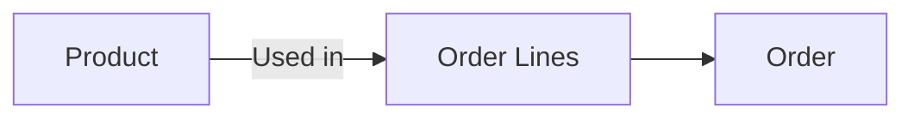
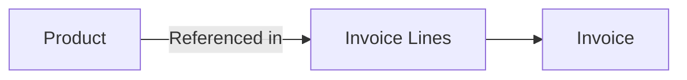

## Overview

Products represent items that are bought, sold, or tracked in your supply chain. In Pollinate, products can have multiple **variants**, which allow you to manage different sizes, colors, configurations, or SKUs under a single product.

## Product Structure

```
Product
├── Basic Information (name, description, SKU)
├── Variants (size, color, configuration)
│   ├── Variant 1
│   ├── Variant 2
│   └── Variant 3
└── Metadata (custom fields, tags)
```

## Product Variants

Variants are nested within products and don't have separate endpoints. Each variant must have a unique name within its parent product.

<Note>
When creating or updating a product, you can include variants directly in the request body. The API uses unique constraints (like variant name) to determine whether to create, update, or delete variants.
</Note>

### Example Product with Variants

```json
{
  "name": "T-Shirt",
  "description": "Cotton t-shirt",
  "sku": "TSH-001",
  "variants": [
    {
      "name": "Small - Blue",
      "sku": "TSH-001-S-B",
      "price": 19.99
    },
    {
      "name": "Medium - Blue",
      "sku": "TSH-001-M-B",
      "price": 19.99
    },
    {
      "name": "Large - Red",
      "sku": "TSH-001-L-R",
      "price": 21.99
    }
  ]
}
```

## Common Use Cases

### 1. Product Catalog Management

Maintain a centralized product catalog that syncs across multiple systems:

- Import products from your ERP
- Sync product data to e-commerce platforms
- Keep product information consistent across sales channels

### 2. Inventory Tracking

Track inventory levels for products and variants:

- Monitor stock levels by variant
- Generate inventory reports
- Set up low stock alerts

### 3. Order Processing

Link products to orders and invoices:

- Create orders with product line items
- Generate invoices from order data
- Track sales by product or variant

## Relationships

### Products → Orders

Products appear in orders as order lines, allowing you to track what was ordered, quantities, and pricing.



### Products → Invoices

Products are referenced in invoices through invoice lines, connecting sales to financial records.



### Products → Suppliers

Products can be linked to suppliers to track sourcing and purchasing relationships.

## Example Workflows

### Creating a Product with Variants

1. **Create the product** with variant information included:

```json
POST /products
{
  "name": "Widget Pro",
  "description": "Premium widget",
  "sku": "WDG-PRO",
  "variants": [
    {
      "name": "Standard",
      "sku": "WDG-PRO-STD",
      "price": 49.99
    },
    {
      "name": "Deluxe",
      "sku": "WDG-PRO-DLX",
      "price": 79.99
    }
  ]
}
```

2. The API creates the product and all variants in a single request.

### Updating Product Variants

When you PATCH a product, include all variants you want to keep. The API will:
- **Create** variants that don't exist (new variant names)
- **Update** variants that match existing unique constraints
- **Delete** variants that aren't in the request

```json
PATCH /products/{id}
{
  "variants": [
    {
      "name": "Standard",  // Existing - will be updated
      "price": 54.99       // Updated price
    },
    {
      "name": "Premium",   // New - will be created
      "sku": "WDG-PRO-PRM",
      "price": 99.99
    }
    // "Deluxe" variant not included - will be deleted
  ]
}
```

### Listing Products

Retrieve products with pagination:

```bash
GET /products?limit=50&offset=0&sort=asc
```

Response includes all variants nested within each product.

## Best Practices

<Tip>
**Variant Naming**: Use consistent naming conventions for variants (e.g., "Size - Color") to make them easier to manage and search.
</Tip>

<Tip>
**SKU Management**: Ensure each variant has a unique SKU to avoid conflicts and maintain accurate inventory tracking.
</Tip>

<Tip>
**Batch Updates**: When updating variants, send the complete list of variants you want to keep, not just the changes. This ensures variants are deleted when removed from your system.
</Tip>

<Warning>
**Variant Deletion**: Be careful when updating products - variants not included in a PATCH request will be deleted. Always include all variants you want to preserve.
</Warning>

## Next Steps

- Learn about [Orders](/guides/orders) and how products are used in order processing
- Understand [Invoices](/guides/invoices) and product line items
- Review the [API Reference](/api-reference/introduction) for complete endpoint documentation
