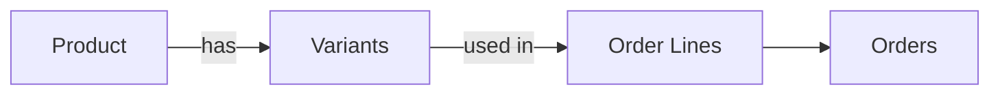
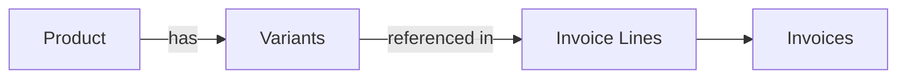

## Overview

Products represent items that are bought, sold, or tracked in your supply chain. In Pollinate, products are top-level containers with comprehensive metadata, and they can have multiple **variants** representing different SKUs, sizes, colors, or configurations. The Products API provides intelligent variant matching, flexible properties storage, and soft delete support.

Each product has:
- **Basic information** - Name, code, description, status
- **Variant management** - Multiple SKU-level variants with pricing and dimensions
- **Properties** - Custom JSONB metadata at product and variant levels
- **Status tracking** - Active or inactive status
- **Soft deletes** - Data preservation with timestamps

## Product and Variant Architecture

Products are structured as follows:

```
Product
├── Core fields (id, organizationId, name, code, description)
├── Status (active, inactive)
├── Properties (custom JSONB)
├── Variants (nested, owned by product)
│   ├── Variant 1
│   │   ├── Core (id, name, sku, barcode)
│   │   ├── Pricing (defaultPrice, uom)
│   │   ├── Dimensions (length, width, height in cm)
│   │   ├── Weights (net, gross in kg)
│   │   └── Properties (custom JSONB)
│   ├── Variant 2
│   └── Variant 3
└── Timestamps (createdAt, updatedAt, deletedAt for soft delete)
```

## Product Status Workflow

Products can be in one of two states:

- **active** - Product is available for use
- **inactive** - Product is not available (archive without deletion)

Products with a `deletedAt` timestamp are soft-deleted and excluded from list and retrieve operations.

<Note>
Soft-deleted products are not physically removed from the database, preserving data for audit trails and recovery. Use the `deletedAt` field to identify soft-deleted records.
</Note>

## Variant Structure and UOM

Variants are SKU-level entities representing specific product configurations. Each variant requires:

**Required Variant Fields (Create):**
- `name` - Variant identifier (unique within product, 1-255 characters)
- `uom` - Unit of measure
- `defaultPrice` - Default pricing (must be >= 0)

**Unit of Measure (UOM) Values:**
- `each` - Individual items
- `kg` - Kilograms
- `g` - Grams
- `litre` - Liters
- `box` - Box quantities
- `carton` - Carton quantities
- `crate` - Crate quantities
- `pallet` - Pallet quantities

**Optional Variant Fields (Create):**
- `sku` - Stock keeping unit (1-255 characters if provided)
- `barcode` - Barcode identifier (1-255 characters if provided)
- Dimensions: `lengthCm`, `widthCm`, `heightCm` (must be >= 0 if provided)
- Weights: `netWeightKg`, `grossWeightKg` (must be >= 0 if provided)
- `quantityInBaseUom` - Quantity in base unit (must be >= 0 if provided)
- `properties` - Custom metadata

**Variant Update Requirements:**
When updating variants via PATCH, the `id` field is **required** to match existing variants. All other fields are optional.

### Example Product with Full Structure

```json
{
  "id": "prod_01G8ZJ5XK9ABCDEFGHIJ",
  "organizationId": "org_f3c5b78a-e19e-40a4-9fdd-6a898dca1bf9",
  "name": "Cozy Winter Sweater",
  "code": "SWEATER-001",
  "description": "Warm winter sweater made from 100% merino wool",
  "status": "active",
  "properties": {
    "material": "wool",
    "color": "navy",
    "category": "outerwear"
  },
  "variants": [
    {
      "id": "var_01G8ZJ5XK9ABCDEFGHIJ",
      "productId": "prod_01G8ZJ5XK9ABCDEFGHIJ",
      "name": "Standard Size",
      "sku": "SWEATER-001-STD",
      "barcode": "1234567890123",
      "uom": "each",
      "defaultPrice": 79.99,
      "quantityInBaseUom": 1,
      "netWeightKg": 0.5,
      "grossWeightKg": 0.6,
      "lengthCm": 60,
      "widthCm": 45,
      "heightCm": 5,
      "properties": {
        "size": "standard",
        "fit": "regular"
      },
      "createdAt": "2024-10-05T14:23:00.000Z",
      "updatedAt": "2024-10-05T14:23:00.000Z",
      "deletedAt": null
    },
    {
      "id": "var_02G8ZJ5XK9ABCDEFGHIJ",
      "productId": "prod_01G8ZJ5XK9ABCDEFGHIJ",
      "name": "Bulk Pack (10 units)",
      "sku": "SWEATER-001-BULK",
      "uom": "box",
      "defaultPrice": 699.99,
      "quantityInBaseUom": 10,
      "netWeightKg": 5.0,
      "grossWeightKg": 6.0,
      "properties": {
        "packSize": 10,
        "discount": 0.12
      },
      "createdAt": "2024-10-05T14:23:00.000Z",
      "updatedAt": "2024-10-05T14:23:00.000Z",
      "deletedAt": null
    }
  ],
  "createdAt": "2024-10-05T14:23:00.000Z",
  "updatedAt": "2024-10-05T14:23:00.000Z",
  "deletedAt": null
}
```

## Common Use Cases

### 1. Product Catalog Management

Maintain a centralized product catalog with multiple variants:

- Import products with variant information from your ERP
- Track multiple SKUs under a single product
- Store custom product metadata and variant properties
- Manage product codes for integration with other systems

### 2. Multi-SKU Management

Handle complex product structures with different variants:

- Create variants for different sizes, colors, or configurations
- Manage different UOMs for bulk ordering (boxes, pallets, etc.)
- Track physical dimensions and weights per variant
- Maintain variant-specific pricing

### 3. Order Processing

Link products to orders and invoices:

- Reference products and variants in order lines
- Create invoices with product line items
- Track sales by product or variant
- Access variant pricing and specifications

### 4. Semantic Search (Vector Embeddings)

Products and variants support automatic vector embeddings for semantic search:

- Products embedded from name + description
- Variants embedded from name + SKU + barcode
- Enables natural language product search
- Non-blocking asynchronous generation

## Relationships

### Products → Orders

Products and variants appear in orders as order lines, enabling you to track what was ordered, quantities, and pricing.



### Products → Invoices

Products are referenced in invoices through invoice lines, connecting sales to financial records.



## Intelligent Variant Diffing

When updating a product, the API intelligently matches incoming variants to existing ones using a two-tier matching system:

### Matching Priority

1. **By ID (Priority 1)** - If an incoming variant includes an `id` field, it matches directly to an existing variant. **Note:** When updating variants, the `id` field is required for reliable matching.
2. **By Name (Priority 2)** - If no ID is provided, the API matches by name (case-insensitive)
3. **Creates** - Incoming variants without ID and no matching name are created
4. **Deletes** - Existing variants not matched by any incoming variant are soft-deleted
5. **Updates** - Matched variants are updated with new values

### Example Diffing Scenarios

**Scenario 1: Update by ID**

```json
Existing variants:
- id: var_1, name: "Standard Size"
- id: var_2, name: "Bulk Pack"

PATCH request:
- id: var_1, defaultPrice: 89.99  → UPDATED (matched by ID)
- id: var_2, defaultPrice: 799.99 → UPDATED (matched by ID)

Result: Both variants updated, no deletions
```

**Scenario 2: Update by Name (Case-Insensitive)**

```json
Existing variants:
- id: var_1, name: "Standard Size"
- id: var_2, name: "Bulk Pack"

PATCH request:
- name: "standard size", defaultPrice: 89.99     → UPDATED (matched by name)
- name: "bulk pack", defaultPrice: 799.99        → UPDATED (matched by name)
- name: "Premium Pack", uom: "box", defaultPrice: 1299.99  → CREATED (no match)

Result: Two updated, one created
```

**Scenario 3: Partial Update (Variants Not Included Deleted)**

```json
Existing variants:
- id: var_1, name: "Standard Size"
- id: var_2, name: "Bulk Pack"
- id: var_3, name: "Pallet Quantity"

PATCH request:
- id: var_1, defaultPrice: 89.99  → UPDATED (included)
- (var_2 and var_3 not included)   → SOFT-DELETED (not in request)

Result: Only var_1 remains active
```

## Properties Merge Behavior

Properties are custom JSONB objects supporting flexible key-value data at two levels:
- **Product Level** - On the product record
- **Variant Level** - On each variant

When updating, properties are merged intelligently:

- **Add new keys** - Provide new property keys that don't exist
- **Update existing keys** - Provide a key with a new value
- **Delete keys** - Set a property key to `null` to delete it
- **Preserve** - Keys not mentioned in the update are unchanged

### Example Product Properties Merge

```javascript
// Initial product properties
{
  "category": "Outerwear",
  "material": "wool",
  "brand": "PolarTech"
}

// PATCH request
{
  "properties": {
    "category": "Winter Wear",    // Update
    "color": "navy",              // Add
    "brand": null                 // Delete
  }
}

// Result
{
  "category": "Winter Wear",
  "material": "wool",
  "color": "navy"
}
```

### Example Variant Properties Merge

```javascript
// Initial variant properties
{
  "size": "standard",
  "fit": "regular",
  "availability": "in-stock"
}

// Update variant properties
{
  "properties": {
    "fit": "slim",               // Update
    "stock-level": 500,          // Add
    "availability": null         // Delete
  }
}

// Result
{
  "size": "standard",
  "fit": "slim",
  "stock-level": 500
}
```

## Example Workflows

### Creating a Product with Multiple Variants

Create a product with comprehensive metadata and multiple variants:

```json
POST /products
{
  "name": "Winter Sweater Collection",
  "code": "WSWEATER-2024",
  "description": "Premium winter sweaters in multiple sizes",
  "status": "active",
  "properties": {
    "season": "winter",
    "collection": "premium",
    "material": "merino-wool"
  },
  "variants": [
    {
      "name": "Standard Pack",
      "sku": "WSWEATER-STD",
      "barcode": "1234567890123",
      "uom": "each",
      "defaultPrice": 79.99,
      "netWeightKg": 0.5,
      "grossWeightKg": 0.6,
      "lengthCm": 60,
      "widthCm": 45,
      "heightCm": 5,
      "properties": {
        "size": "standard",
        "fit": "regular"
      }
    },
    {
      "name": "Bulk Pack (10x)",
      "sku": "WSWEATER-BULK",
      "uom": "box",
      "defaultPrice": 699.99,
      "quantityInBaseUom": 10,
      "netWeightKg": 5.0,
      "grossWeightKg": 6.0,
      "properties": {
        "packSize": 10,
        "discount": 0.12
      }
    }
  ]
}
```

### Updating Variants by ID

Update specific variants using their IDs. **Note:** The `id` field is **required** for variant updates:

```json
PATCH /products/prod_01G8ZJ5XK9ABCDEFGHIJ
{
  "variants": [
    {
      "id": "var_01G8ZJ5XK9ABCDEFGHIJ",
      "name": "Standard Pack",
      "defaultPrice": 89.99,
      "properties": {
        "discount": 0.10
      }
    }
  ]
}
```

**Important:** When updating variants, you must include the `id` field. Variants without `id` will be matched by name (case-insensitive) or created if no match is found.

### Updating Variants by Name

Update variants without tracking IDs by matching on name (case-insensitive):

```json
PATCH /products/prod_01G8ZJ5XK9ABCDEFGHIJ
{
  "variants": [
    {
      "name": "standard pack",
      "defaultPrice": 89.99
    },
    {
      "name": "bulk pack (10x)",
      "defaultPrice": 749.99
    }
  ]
}
```

### Merging Product Properties

Add, update, and delete properties in one request:

```json
PATCH /products/prod_01G8ZJ5XK9ABCDEFGHIJ
{
  "properties": {
    "collection": "winter-2025",
    "discontinued": null,
    "warehouse-location": "A-12-05"
  }
}
```

### Complex Multi-Field Update

Update product metadata, manage variants, and modify properties all at once:

```json
PATCH /products/prod_01G8ZJ5XK9ABCDEFGHIJ
{
  "name": "Winter Sweater Collection v2",
  "status": "active",
  "properties": {
    "version": 2,
    "last-updated": "2024-10-15",
    "old-sku": null
  },
  "variants": [
    {
      "id": "var_01G8ZJ5XK9ABCDEFGHIJ",
      "defaultPrice": 89.99,
      "properties": {
        "discount": 0.15
      }
    },
    {
      "name": "Premium Pack (5x)",
      "sku": "WSWEATER-PREMIUM",
      "uom": "box",
      "defaultPrice": 449.99,
      "quantityInBaseUom": 5
    }
  ]
}
```

**Note:** The first variant includes `id` (required for updates), while the second variant has no `id` and will be matched by name or created if no match exists.

## Filtering, Sorting, and Pagination

### Filter by Status

```bash
# List active products only
curl -X GET "https://api.example.com/products?status=active" \
  -H "Authorization: Bearer YOUR_TOKEN" \
  -H "x-org-id: org_xxxx"
```

### Search Products

```bash
# Search in name, code, or description
curl -X GET "https://api.example.com/products?search=winter" \
  -H "Authorization: Bearer YOUR_TOKEN" \
  -H "x-org-id: org_xxxx"
```

### Pagination

```bash
# Get first 50 products
curl -X GET "https://api.example.com/products?limit=50&offset=0" \
  -H "Authorization: Bearer YOUR_TOKEN" \
  -H "x-org-id: org_xxxx"

# Get next 50 products
curl -X GET "https://api.example.com/products?limit=50&offset=50" \
  -H "Authorization: Bearer YOUR_TOKEN" \
  -H "x-org-id: org_xxxx"
```

### Sorting

```bash
# Sort by name (ascending)
curl -X GET "https://api.example.com/products?sort=name&direction=asc" \
  -H "Authorization: Bearer YOUR_TOKEN" \
  -H "x-org-id: org_xxxx"

# Sort by creation date (newest first)
curl -X GET "https://api.example.com/products?sort=createdAt&direction=desc" \
  -H "Authorization: Bearer YOUR_TOKEN" \
  -H "x-org-id: org_xxxx"
```

## Best Practices

<Tip>
**Variant IDs**: When tracking variants, store their IDs for reliable updates. The `id` field is **required** when updating variants via PATCH. This avoids potential name-matching issues and ensures precise updates.
</Tip>

<Tip>
**Distinct Variant Names**: Ensure variant names are unique within a product to avoid ambiguity when using name-based matching.
</Tip>

<Tip>
**Comprehensive Updates**: When updating products, include all variants you want to preserve. Variants not in the request are soft-deleted.
</Tip>

<Tip>
**Properties for Metadata**: Use properties for flexible, custom metadata like warehouse locations, integration IDs, or tags. Don't rely on properties for critical filtering.
</Tip>

<Tip>
**Soft Deletes**: Deleted products and variants aren't removed from the database - they're marked with a `deletedAt` timestamp for audit trails and recovery.
</Tip>

<Warning>
**Variant Deletion Risk**: Be careful when updating products - variants not included in a PATCH request will be soft-deleted. Always include all variants you want to preserve.
</Warning>

<Warning>
**Status Changes**: Changing a product to `inactive` doesn't delete it - it remains in the database but is logically unavailable. Use DELETE for soft deletion instead.
</Warning>

## Next Steps

- Learn about [Orders](/guides/orders) and how products are used in order processing
- Understand [Invoices](/guides/invoices) and product line items
- Review the [Customers](/guides/customers) guide to understand customer relationships
- Explore the [API Reference](/api-reference/introduction) for complete endpoint documentation
