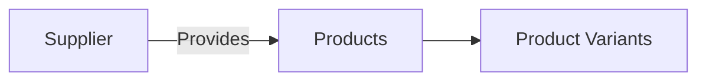
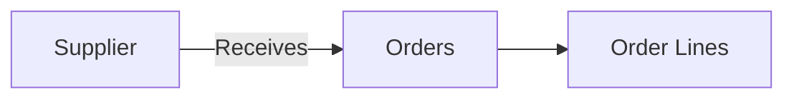
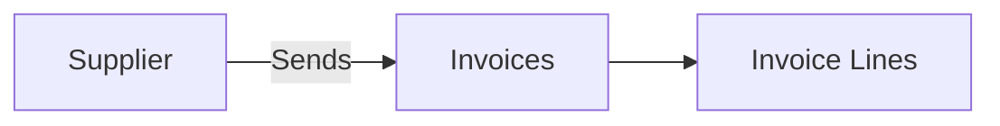

## Overview

Suppliers represent the companies or vendors you purchase products and services from. Like customers, suppliers are technically **partners** (see the [Partners guide](/guides/partners) for more details), which means they can have multiple locations and contacts associated with them.

## Supplier Structure

```
Supplier (Partner)
├── Basic Information (name, company, tax ID)
├── Locations (receiving, remit-to addresses)
│   ├── Location 1
│   ├── Location 2
│   └── Location 3
└── Contacts (people, roles, email, phone)
    ├── Contact 1
    ├── Contact 2
    └── Contact 3
```

## Locations and Contacts

Locations and contacts are sub-resources nested within suppliers. They don't have separate endpoints - you manage them as part of the supplier object.

<Note>
When creating or updating a supplier, include locations and contacts directly in the request body. The API uses unique constraints to determine whether to create, update, or delete these sub-resources.
</Note>

### Example Supplier with Locations and Contacts

```json
{
  "name": "Global Manufacturing Co",
  "company": "Global Mfg",
  "taxId": "SUP789012",
  "locations": [
    {
      "name": "Main Factory",
      "address": "999 Factory Road",
      "city": "Detroit",
      "state": "MI",
      "zipCode": "48201",
      "country": "USA",
      "type": "shipping"
    },
    {
      "name": "Accounts Payable",
      "address": "100 Corporate Blvd",
      "city": "Chicago",
      "state": "IL",
      "zipCode": "60601",
      "country": "USA",
      "type": "billing"
    }
  ],
  "contacts": [
    {
      "name": "Sarah Chen",
      "email": "sarah@globalmfg.com",
      "phone": "+1-555-0200",
      "role": "Sales Representative"
    },
    {
      "name": "Mike Rodriguez",
      "email": "mike@globalmfg.com",
      "phone": "+1-555-0201",
      "role": "Shipping Coordinator"
    }
  ]
}
```

## Common Use Cases

### 1. Supplier Relationship Management

Maintain comprehensive supplier information:

- Store multiple shipping and billing addresses
- Track different contacts for sales, shipping, and accounting
- Manage supplier-specific terms and agreements

### 2. Purchase Order Management

Use supplier data when creating purchase orders:

- Route orders to appropriate suppliers
- Use correct shipping addresses for deliveries
- Contact suppliers about order status

### 3. Invoice Processing

Link supplier invoices for accounts payable:

- Match incoming invoices to suppliers
- Route invoices to appropriate contacts for approval
- Track accounts payable by supplier

### 4. Product Sourcing

Link products to suppliers to track sourcing:

- Identify which suppliers provide which products
- Compare pricing across suppliers
- Manage supplier catalogs

## Relationships

### Suppliers → Products

Suppliers can be linked to products to track sourcing relationships.



### Suppliers → Orders

Suppliers can be referenced in purchase orders and related documents.



### Suppliers → Invoices

Suppliers send invoices for purchases, connecting procurement to accounts payable.



## Example Workflows

### Creating a Supplier with Locations and Contacts

1. **Create the supplier** with all related information:

```json
POST /suppliers
{
  "name": "Quality Components Ltd",
  "company": "Quality Components",
  "locations": [
    {
      "name": "Manufacturing Facility",
      "address": "555 Component Ave",
      "city": "Austin",
      "state": "TX",
      "zipCode": "78701",
      "type": "shipping"
    }
  ],
  "contacts": [
    {
      "name": "David Kim",
      "email": "david@qualitycomponents.com",
      "role": "Account Manager"
    }
  ]
}
```

2. The API creates the supplier, locations, and contacts in a single request.

### Adding Multiple Shipping Locations

Update the supplier to include additional shipping locations:

```json
PATCH /suppliers/{id}
{
  "locations": [
    {
      "name": "Manufacturing Facility",  // Existing - preserved
      "address": "555 Component Ave",
      "city": "Austin",
      "state": "TX",
      "zipCode": "78701",
      "type": "shipping"
    },
    {
      "name": "East Coast Warehouse",  // New - will be created
      "address": "777 Distribution Dr",
      "city": "Atlanta",
      "state": "GA",
      "zipCode": "30301",
      "type": "shipping"
    },
    {
      "name": "Corporate Office",  // New - will be created
      "address": "888 Business St",
      "city": "Atlanta",
      "state": "GA",
      "zipCode": "30302",
      "type": "billing"
    }
  ]
}
```

### Managing Supplier Contacts

Update contacts to reflect current personnel:

```json
PATCH /suppliers/{id}
{
  "contacts": [
    {
      "name": "David Kim",  // Existing - will be updated
      "email": "david.new@qualitycomponents.com",  // Updated email
      "role": "Senior Account Manager"  // Updated role
    },
    {
      "name": "Lisa Park",  // New - will be created
      "email": "lisa@qualitycomponents.com",
      "role": "Logistics Coordinator"
    }
  ]
}
```

## Best Practices

<Tip>
**Location Types**: Use location types (e.g., "shipping", "billing", "remit-to") consistently to help automate routing of orders and invoices.
</Tip>

<Tip>
**Contact Management**: Keep supplier contacts up-to-date, especially for critical roles like shipping coordinators and accounts payable contacts.
</Tip>

<Tip>
**Supplier Catalogs**: Link products to suppliers to build a comprehensive view of your supply chain and identify alternative sources.
</Tip>

<Warning>
**Sub-resource Deletion**: When updating suppliers, always include all locations and contacts you want to keep. Missing items will be deleted.
</Warning>

## Next Steps

- Learn about the [Partners](/guides/partners) model that connects customers and suppliers
- Understand how suppliers relate to [Products](/guides/products)
- Review [Invoices](/guides/invoices) and supplier billing relationships
